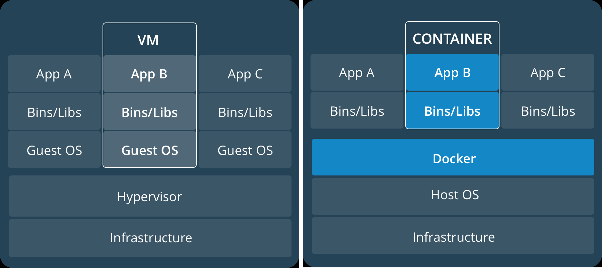

## 一、Docker简介

### 1.1、什么是Docker

​	Docker是在2013年由dotCloud发起的一个开源项目，使用Go语言进行开发，基于LInux内核的cgroup、namespace等技术，对进程进行封装隔离，属于操作系统层面的虚拟化技术。

​	Docker基于LXC的基础上进一步封装，从文件系统、网络互联到进程隔离等等，极大简化了容器的创建和维护，使Docker技术比虚拟机技术更为轻便、快捷。

### 1.2、为什么使用Docker

- 更高效的系统资源利用率

  ​	由于容器不需要进行硬件虚拟化以及运行完整操作系统等额外开销，Docker对系统资源利用率更高。无论是应用执行速度、内存损耗或者文件存储速度，都要比传统虚拟机技术更高效。因此，相比虚拟机技术，一个相同配置的主机，往往可以运行更多数量的应用。

- 更快速的启动时间

  传统虚拟机技术启动应用服务因需要启动完整的操作系统，往往需要数分钟，而Docker容器应用运行于宿主机内核，无需启动完整的操作系统，因此可以做到秒级、甚至毫秒级启动。大大节约了开发、测试、部署的时间。

- 环境一致性

  开发过程中一个常见的问题是环境一致性问题。由于开发、测试、预发布、生产环境不一致，导致有些问题未及时发现。而Docker的镜像提供了除内和外完整的运行时环境，确保了应用运行环境一致性。

- 更高效的持续交付和部署

  通过Docker可以定制应用镜像实现持续集成、持续交付、持续部署，可以很容器的部署或迁移到另一个平台，而不用担心运行环境的变化导致应用无法正常运行。

- 更轻松的维护和扩展

  Docker使用分层存储以及镜像的技术，可以更容易的复用应用重复部分，应用的部署、运维也更加简单。

对比传统虚拟机总结：

| 特性       | 容器               | 虚拟机       |
| ---------- | ------------------ | ------------ |
| 启动       | 秒级               | 分钟级       |
| 硬盘使用   | 一般为MB           | 一般为GB     |
| 性能       | 接近原生           | 弱于原生     |
| 系统支持量 | 单机支持上千个容器 | 一般为几十个 |

### 1.3、基本概念

Docker包含了三大基本概念：

- 镜像(Image)

  Docker镜像是一个特殊的文件系统，除了提供容器运行时所需的程序、库、资源、配置等文件外，还包含了一些为运行时准备的一些配置参数（如环境变量、用户等）。镜像不包含任何动态数据，其内容在构建之后也不会被改变，这个和容器的根本区别。

- 容器(Container)

  镜像和容器的关系，就像是面向对象程序设计中的**类**和**实例**一样，镜像是静态的定义，容器是镜像运行时的实体。容器可以被创建、启动、停止、删除、暂停等。容器运行时，以镜像为基础层（镜像本身时只读的），在其上创建一个可写层，镜像本身时保持不变的。

- 仓库(Repository)

  Docker仓库类似于代码仓库，是Docker集中存放镜像文件的地方。很多时候有人会将Docker仓库和注册服务器（registry）混为一谈。实际上，注册服务器是存放仓库的地方，可以包含多个仓库；每个仓库可以包含多个标签（tag）；每个标签对应一个镜像。

