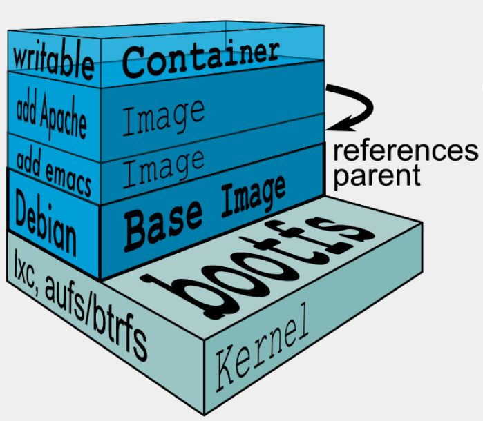

## 五、Docker联合文件系统

#### 5.2.1、基本原理

​	联合文件系统（UnionFS）是一种轻量级的高性能分层文件系统，它支持将文件系统中的修改信息作为一次提交，并层层叠加，同时可以将不同目录挂载到同一个虚拟文件系统下。

联合文件系统是实现Docker镜像的技术基础。镜像可以通过分层来继承。例如，用户基于基础镜像（没有父镜像的镜像成为基础镜像）来制作各种不同的应用镜像。这些镜像共享同一个基础镜像曾，提高了存储效率。此外，当用户改变一个Docker镜像，则一个新的层（layer）会被创建。因此，用户不用替换整个原镜像或者重新建立，只要添加新层即可用户分发镜像的时候，也只需要分发被改动的新层内容（增量部分）。这让Docker的镜像管理变得十分轻量级和快速。

#### 5.2.2、Docker常见联合文件系统

- devicemapper

  1、建议不要在生产环境使用此存储方案

  2、本地文件容易丢失，且不容易扩展空间

  3、从性能上而言，本地文件挂接方式让存储结构跟复杂且性能更低

  4、本地文件在集群和分布式存储方式中让系统架构更加复杂

  5、不能很好的体现data数据和meta数据分离的优越性

- overlay

  1、RHEL/CentOS 必须是 7.2 或以上版本

  2、Docker必须是最新版本，并且支持Overlay

  3、底层文件系统必须是XFS

  4、SELinux在宿主机上必须打开设为enforcing模式，但docker服务启动时不能打开支持selinux选项，不能设置"--selinux-enabled"。目前RHEL 7.2系统还不支持overlay下的selinux

  5、为了支持yum和rpm工具在以overlay为基础的容器中正常运行，需要安装yum-plugin-ovl软件包。

- overlay2

  1、overlay2 是 overlay 的升级，与overlay的结构基本相同

  2、使用了从写的函数，在存储上是不兼容的，因此从overlay升级的话需要删除所有的镜像和容器

  3、Overlay2解决了overlay inode损耗和提交（commit）性能问题，但是只在Docker 1.11之后的版本才能实现

  4、overlay2在docker 18之前的版本需要升级内核版本才可以使用，目前最新版已经不需要升级内核即可使用

