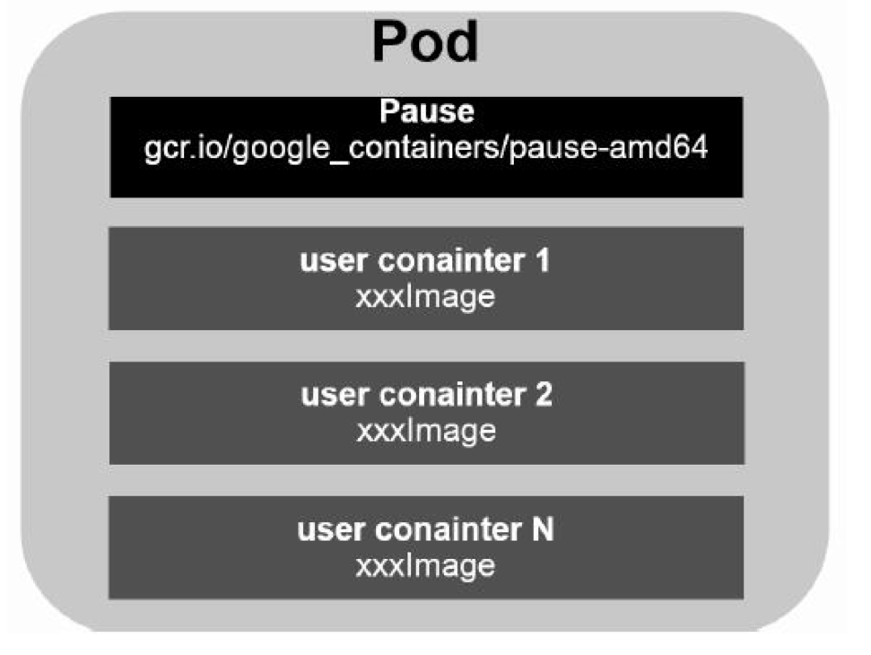
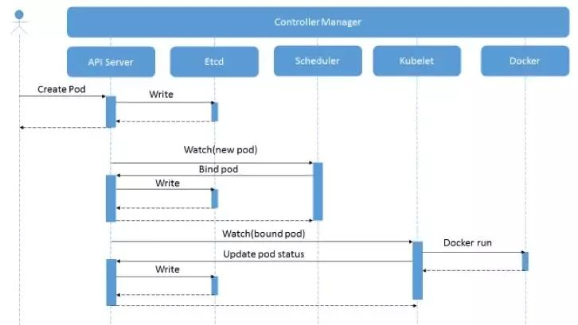
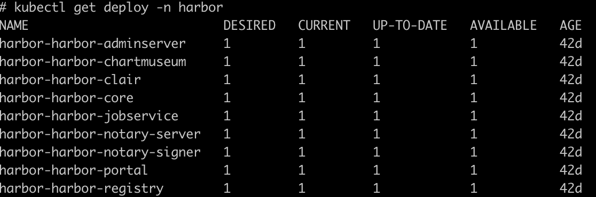

[TOC]

## 一、概述

### 1.1、什么是Kubernetes 

​	Kubernetes是容器集群管理系统，是一个开源平台，可以实现容器集群的自动化部署、自动扩缩容、调度、维护等功能。通过Kubernetes你可以：

- 快速部署应用
- 快速扩展应用
- 无缝对接新的应用功能
- 节省资源，优化硬件资源利用率


### 1.2、Kubernetes特点

- **可移植**：支持公有云、私有云、混合云、多重云
- **可扩展**：模块化、插件化、可挂载、可组合
- **自动化**：自动部署、自动重启、自动复制、自动伸缩/扩展


### 1.3、Kubernetes组件

**master节点：**

- **etcd**：

  一致性的KV存储系统，保存了整个集群的状态。除了具备状态存储的功能，还有事件监听和订阅、Leader选举的功能，所谓事件监听和订阅，各个其他组件通信，都并不是互相调用 API 来完成的，而是把状态写入 etcd（相当于写入一个消息），其他组件通过监听 etcd 的状态的的变化（相当于订阅消息），然后做后续的处理，然后再一次把更新的数据写入 etcd。所谓 Leader 选举，其它一些组件比如 Scheduler，为了做实现高可用，通过 etcd 从多个（通常是3个）实例里面选举出来一个做Master，其他都是Standby。

- **apiserver**：

  刚才说了 etcd 是整个系统的最核心，所有组件之间通信都需要通过 etcd，实际上，他们并不是直接访问 etcd，而是访问一个代理，这个代理是通过标准的RESTFul API，重新封装了对 etcd 接口调用，K8S里所有资源的增、删、改、查等操作，除此之外，这个代理还实现了一些附加功能，比如身份的认证、访问控制、API注册、发现、缓存等。这个代理就是 API Server。

- **controller manager**：

  kubernetes里所有资源对象的自动化控制中心，可以理解为资源对象的"大总管"。每一个任务请求发送给Kubernetes 之后，都是由 Controller Manager 来处理的，每一个任务类型对应一个 Controller Manager。

- **scheduler**：

  负责资源的调度，Controller Manager 会把任务对资源要求，其实就是 Pod，写入到 etcd 里面，Scheduler 监听到有新的资源需要调度（新的 Pod），就会根据整个集群的状态，给 Pod 分配到具体的节点上，相当于公交公司的"调度室"。

**node节点：**

- **kubelet**：

  是一个 Agent，运行在每一个节点上，它会监听 etcd 中的 Pod 信息，发现有分配给它所在节点的 Pod 需要运行，就在节点上运行相应的 Pod，并且把状态更新回到 etcd。维护容器的生命周期，同时也负责Volume（CVUI）和网络（CNI）的管理。

- **kube-proxy**：

  负责为Service提供Cluster内部的服务发现和负载均衡

- **container runtime**：

  负责镜像管理以及Pod和容器的真正运行（CRI）

**除了核心组件，还有一些推荐的Add-ons：**

- coredns：

  负责为整个集群提供DNS服务

- ingress controller：

  为服务提供外网入口

- heapster：

  提供资源监控，逐步被放弃，被metrics-server代替

- metrics-server：

  metrics Server 是集群范围资源使用数据的聚合器，用来替换heapster

- dashboard：

  提供GUI

- federation：

  提供跨可用区、跨云的多集群管理

- fluentd-elasticsearch：

  提供集群日志采集、存储与查询

- prometheus：

  提供集群的监控采集与查询


### 1.4、kubernetes架构图


### 1.5、kubernetes分层架构


- 核心层：kubernetes最核心的功能，对外提供API构建高层的应用，对内提供插件式应用执行环境
- 应用层：部署（无状态应用、有状态应用、批处理任务、集群应用等）和路由（服务发现、DNS解析等）
- 管理层：系统度量（如基础设施、容器和网络的度量），自动化（如自动扩展、动态Provision等）以及策略管理（RBAC、Quota、PSP、NetworkPolicy等）
- 接口层：kubectl命令行工具、客户端SDK以及集群联邦
- 生态系统：在接口层之上的庞大容器集群管理调度的生态系统，可以分为两个范畴
  - kubernetes外部：日志、监控、配置管理、CI、CD、Workflow、FaaS、OTS应用、ChatOps等
  - kubernetes内部：CRI、CNI、CVI、registry、Cloud Provider、集群自身的配置和管理等


## 二、kubernets基本概念

### 2.1、Master

​	Kubernets里的master指的是集群控制节点，每个kubenetes集群里需要至少有一个master节点来负责整个集群的管理和控制，基本上kubbenetes所有的控制命令都是发给它，它来负责具体的执行过程。master节点是整个集群的"大脑"，如果出现宕机或不可用，那我们所有控制命令都会失效，所以一般会配置master节点高可用。

### 2.2、Node

​	Node节点可以在运行期间动态的加入到kubernetes集群中，前提是这个节点已经正确安装、配置和启动了相关组件，在默认情况下kubelet会向master注册自己，这也是kubernetes推荐的Node管理方式。

​	一旦Node被纳入集群管理范围，kubelet进程就会定时向master节点汇报自身的情况，例如操作系统、Docker版本、机器资源（cpu、mem等）情况，以及之前有哪些Pod在运行等，这样master可以获知每个Node的资源使用情况，并实现高效均衡的资源调度策略。

​	某个Node超过指定时间不上报信息时，会被master判定为"失联"，Node的状态会被标记为不可用（Not Ready），随后master会触发"工作负载大转移"的自动流程。

### 2.3、Pod

#### 2.3.1、基本原理

​	Pod是kubernetes最重要最基本的概念，每个Pod都会有一个特殊的被称为"根容器"的Pause容器。Pause容器对应的镜像属于kubernetes平台的一部分，除了Pause容器，每个Pod还包含一个或多个紧密相关的用户业务容器。

​	在一组容器作为一个单元的情况下，我们难以对"整体"简单的进行判断及有效的进行处理。比如，一个容器不可用了，此时算是整体不可用吗？是n/m的不可用率吗？引入业务无关并且不容易停止服务的Pause容器作为pod的根容器，以它的状态代表整个容器组的状态，就简单、巧妙的解决了这个问题。

​	Pod里的多个业务容器共享pause容器的IP，共享Pause容器挂载的Volume，这样既简化了密切关联的业务容器之间的通信问题，也解决了容器之间的文件共享问题。

​	Kubernetes为每个Pod都分配了唯一的IP地址，一个Pod里的多个容器共享Pod IP地址。kubernetes要求底层网络支持集群内任意两个pod之间的TCP/IP直接通信，这通常采用虚拟二层网络技术来实现，例如Flannel、calico等。在kubernetes里，一个Pod里的容器与不通主机上的Pod容器能够直接通信。



#### 2.3.2、Pod创建过程

- 通过apiserver REST API发起创建Pod请求，也可以是kubectl命令行。

- apiserver接收到创建Pod的请求后，将数据写入etcd中。
- scheduler通过apiserver watch API监测发现新Pod，这个时候Pod还没有和任何Node节点绑定。
- schedule通过指定的资源量等规则过滤掉不符合要求的Node节点（调度预选）
- schedule接着对上一步符合要求的Node节点进行打分，在打分阶段，schedule会考虑整体优化方案，例如将一个Replication Set的副本分布到不同的Node节点上、使用最低负载的Node节点等。
- scheduler经过复杂的调度策略，选择出打分最高的Node节点，将Pod和筛选出的Node进行绑定，同时将信息更新到etcd中。
- kubelet通过apiserver watch API监测到有新的Pod被调度过来了，就将Pod的相关数据传递给容器运行时（container runtime）例如Docker，让它运行此Pod
- kubelet通过container runtime获取Pod的状态，然后通知给apiserver，由apiserver处理写入etcd。



#### 2.3.3、Endpoint

​	Pod的IP加上启动的容器端口，组成了一个新的概念-Endpoint，它代表着此Pod里的一个服务进程的对外通信地址。一个Pod也存在着具有多个Endpoint的情况。

#### 2.3.4、Event

​	Event是一个事件的记录，记录了事件的最早产生时间、最后重现时间、重复次数、发起者、类型，以及导致此事件的原因等信息。Event通常会关联到某个具体的资源对象上，是排查故障的重要参考信息。

#### 2.3.5、Resources

​	每个Pod都可以对其能使用的服务器上的计算资源设置限额，当前可以设置限额的计算资源有CPU与Memory两种，这里的资源单位是一个绝对值而不是相对值。通常以千分之一的配额单位为最新单位（CPU：m，MEM：Mi）。

​	在k8s有两个资源配额设置项：

- Requests：资源最小的申请量，系统必须满足需求
- Limits：资源最大允许使用量，不能被超过，当容器试图使用超过这个量的资源时，可能会被k8s Kill并重启

### 2.4、Label

#### 2.4.1、基本原理

​	Label是k8s系统中另外一个核心概念。一个Label是一个key=value的键值对，其中key与value由用户自己制定。Label可以关联到各种资源对象上，比如Node、Pod、Service等，一个资源对象可以定义任意数量的Label，同一个Label也可以被添加到任意数量的资源对象上，Label通常在资源对象定义时确定，也可以在资源对象创建后添加或删除。

​	我们可以通过给指定的资源对象关联一个或多个不同的Label来实现多维度的资源分组管理功能，以便于灵活、方便的进行资源分配、调度、配置、部署等管理工作。

#### 2.4.2、Label Selector

##### 2.4.2.1、基本原理

​	给某个资源对象定义个Label后，就可以通过Label Selector（标签选择器）查询和筛选拥有某些Label的资源对象，k8s通过这种方式实现了类型SQL的简单又通用的对象查询机制。

​	Label Selector可以被类比为SQl语句中的where查询条件，例如：role=ingress作用于Pod时，可以类比为select * from pod where pod's name='ingress'这样的SQL语句。当前Label Selector分为两种：

- **基于等式（Equality-based）**：name=ingress，匹配所有具有标签name=ingress的资源对象；env != prd，匹配所有不具有标签env=prd的资源对象，比如env=qa就满足此条件。
- **基于集合（Set-based）**：env in （dev,qa），匹配所有具体标签env=dev或env=qa的资源对象；env notin （prd），匹配所有不具有标签env=prd的资源对象。

​    可以通过多个Label Selector表达式的组合实现复杂的条件选择，多个表达式之间用"，"分隔，几个条件之间是"AND"的关系。

##### 2.4.2.2、Label Selector重要使用场景

- kube-controller进程通过资源对象RS上定义的Label Selector来筛选要监控的Pod副本数量，从而实现Pod副本的数量始终符合预期设定的全自动控制流程。
- kube-proxy进程通过Servcie的Label Selector来选择对应的Pod，自动建立起每个Service到对应Pod的请求转发路由表，从而实现Service的智能负载均衡机制。
- 通过对某些Node定义特定的Label，并且在Pod定义文件中使用NodeSelector这种标签调度策略，kube-scheduler进程可以实现Pod“"定向调度"的特性。

​     使用Label可以给对象创建多组标签，Label和Label Selector共同构成了k8s系统中最核心的应用模型，使得被管理对象能够被精细分组管理，同时实现了整个集群的高可用性。


### 2.5、Replica Set

​	Replica Set（后面简称RS）是Replication Controller（后面简称RC）的升级版，唯一的区别是Replica Set支持基于集合的Label Selector（Set-based Selector），而RC只支持基于等式的Label Selector（Equality-based Selector），这使得RS功能更强。实际上，我们很少单独使用RS，它主要被Deployment这个更高层的资源对象所包含，从而形成一整套Pod创建、删除、更新的编排机制。当我们使用Deployment时，无需关系它是如何创建、维护RS的，这一切都是自动发生的。

​	Replica Set是k8s系统中的核心概念之一，它定义了一个期望的场景，即声明某种Pod的副本数量在任意时刻都符合某个预期值，RS的定义包括以下几个部分：

- Pod期待的副本数（replicas）
- 用于筛选目标Pod的Label Selector
- 当Pod的副本数量小于预期数量的话，用于创建新Pod的Pod模版。

​      当我们定义了一个RS并提交到k8s以后，Master节点上的Controller Manager组件就得到通知，定期巡检系统中当前存活的目标Pod，并确保目标Pod实例的数量刚好等于此RS的期望值，如果有过多的Pod副本在运行，系统就会停掉一些Pod，否则，系统就会再自动创建一些Pod。通过RS，k8s实现了用户应用集群的高可用性，并且大大减少了系统管理员在传统IT架构中许多手动运维工作。

​	通常我们升级应用时，希望更平滑的方式，比如停止一个旧版本Pod，同时升级一个新版本Pod，在整个升级过程中，Pod数量始终不变，也一直有Pod提供服务，不至于服务中断。通过RS机制，k8s很容易实现这种高级实用的特性，被称为"滚动更新（Rolling Update）"。


### 2.6、Deployment

#### 2.6.1、基本原理

​	Deployment内部使用了Replica Set来实现的，Deployment相对于RC的一个最大升级时我们可以随时知道当前Pod"部署"的进度。实际上由于一个Pod的创建、调度、绑定节点及在目标Node上启动对应的容器这一完整过程需要一定的时间，所有我们期望系统启动N个Pod副本的目标状态，实际上是一个连续变化的"部署过程"导致的最终状态。

#### 2.6.2、典型场景

- 创建一个Deployment对象来生成对应的Replica Set并完成Pod副本的创建过程
- 检查Deployment的状态来看部署动作是否完成（Pod副本的数量是否达到预期的值）
- 更新Deployment以创建新的Pod（比如镜像升级）
- 如果当前Deployment不稳定，则回滚到一个早先的Deployment版本
- 挂起或者恢复一个Deployment

#### 2.6.3、Deployment说明



- NAME：Deployment的名称
- DESIRED：Pod副本数量的期望值，即Deployment里定义的replica。
- CURRENT：当前replica的值，实际上是Deployment所创建的replica set里的replica值，这个值不断增加，直到达到DESIRED为止，表明整个部署过程完成。
- UP-TO-DATE：最新版本Pod的副本数量，用于指示在滚动升级的过程中，有多少个Pod副本已经成功升级。
- AVAILABLE：当前集群中可用的Pod副本数量，即集群中当前存活的Pod数量。
- AGE：Deployment创建时长


从上图可以看到，Pod的命名以Deployment对应的Reploca Set的名字为前缀，这种命名很清晰的表明了一个Replica Set创建了哪些Pod，对于Pod滚动升级这样复杂的过程来说，很容易排错。


### 2.7、Horizontal Pod Autoscaler(HPA)

#### 2.7.1、基本原理

​	HPA是Pod的横向自动扩容，与RS、Deployment一样，也是一种kubernetes资源对象。通过追踪分析RS控制的所有目标Pod的负载变化情况，来确定是否需要针对性的调整目标Pod的副本数。HPA不支持无法缩放的对象，比如DaemonSet。从v1.11版本开始，HPA默认已经不在从heapser获取资源指标，通常由metrics-server提供。


### 2.8、Service

#### 2.8.1、基本原理

​	k8s的service定义了一个服务的访问入口地址，前端的应用（Pod）通过这个入口地址访问其后的一组由Pod副本组成的集群实例，Service与其后端Pod副本集群之间则是通过Label Selector来实现"无缝对接"的，而RS的作用实际上是保证Service的服务能力和服务质量始终处于预期的标准。

​	每个Pod都会被分配一个单独的IP，而且每个Pod都提供了一个独立的Endpoint以被客户端访问，现在多个Pod副本组成了一个集群来提供服务。每个Node上运行的有一个kube-proxy，是一个智能的软件负载均衡器，监控着k8s的增加、删除Service，kube-proxy会随机开启一个本机端口，任何发向这个端口的请求都会被转发到后端的Pod中，即负责把对Service的请求转发到后端的某个Pod实例上，并在内部实现服务的负载均衡与会话保持机制。而如何选择是哪一个后端的pod的是基于SessionAffinity进行的分配。kube-proxy会增加iptables rules来实现捕捉这个服务的Ip和端口来并重定向到前面提到的端口。

​	Service不是共用一个负载均衡器的IP地址，而是每个Servcie分配来一个全局唯一的虚拟IP地址，这个虚拟IP被称为Cluster IP。这样，每个服务就变成了具备唯一IP地址的"通信节点"，服务调用就变成了最基础的TCP网络通信问题。

​	Pod的Endpoint地址会随着Pod的销毁和重建而发生改变，因为新Pod的IP地址与之前旧Pod不同。而Service一旦创建，k8s就会自动为它分配一个可用的Cluseter IP，而且在Service的整个生命周期内，它的Cluseter IP不会发生改变。于是，服务发现这个棘手的问题在k8s的架构里也得以解决：只要Service的Name与Service的Cluster IP地址做一个dns域名映射即可。

​	Service的spec.ports定义中，targetPort属性用来指定提供该服务的容器所暴露（EXPOSE）的端口号，即具体业务进程在容器内的targePort上提供TCP/IP接入；而port属性定义了Service的虚拟端口，若没有指定targetPort，默认targetPort与port相同。

​	很多服务都存在多个端口的问题，通常一个端口提供业务服务，另外一个端口提供管理服务。k8s Service支持多个Endpoint，在存在多个Endpoint的情况下，要求每个Endpoint定义一个名字来区别。

```
apiVersion: v1
kind: Service
metadata:
 name: tomcat
spec:
 potrs:
 - name: service
   port: 8080
 - name: shutdown
   port: 8005
```

​	多端口为什么要给每个端口命名呢？这就涉及k8s的服务发现机制了。

#### 2.8.2、服务发现

​	任何分布式系统都会涉及"服务发现"这个问题，大部分分布式系统通过提供特定的API接口来实现服务发现，但这样做会导致平台的侵入性比较强，也增加了开发测试的困难。因此，k8s引入了dns系统，把服务名作为dns域名，这样，程序就可以直接使用服务名来建立通信连接了。

#### 2.8.3、Service外部服务

对于我们的应用服务来说，可能存在部分需要外部访问的，Service有三种方式：

- ClusterIP：使用一个集群固定IP，无法在集群外部使用，这个是默认选项。
- NodePort：使用一个集群固定IP，但额外会在每个Node上为需要外部访问的Service开启一个对应的TCP监听端口。使用Node IP+Node Port即可访问此服务。
- LoadBalancer：使用集群固定IP和NodePort，额外还会申请一个负载均衡器来转发到服务（load balancer ）

   

### 2.9、Volume

#### 2.9.1、基本原理

​	容器中的磁盘的生命周期是短暂的，这就带来了一系列的问题，第一，当一个容器损坏之后，kubelet 会重启这个容器，但是文件会丢失-这个容器会是一个全新的状态，第二，当很多容器在同一Pod中运行的时候，很多时候需要数据文件的共享。k8s Volume就是用来解决这个问题的。

​	k8s Volume和Docker Volume很类似，但不能等价：

- k8s Volume是定义在Pod上的，然后被一个Pod里的多个容器挂载到具体目录。
- k8s Volume与Pod的生命周期相同，但与容器生命周期不同，容器终止、重启时，Volume中的数据不会丢失。

#### 2.9.2、volume类型

k8s支持如下类型的volume:

```
emptyDir
hostPath
gcePersistentDisk
awsElasticBlockStore
nfs
iscsi
glusterfs
rbd
gitRepo
secret
persistentVolumeClaim
```

**emptyDir**

​	emptyDir Volume是在Pod分配到Node时创建的，并且会一直存在在Pod的生命周期当中，初始内容为空，并且无需指定宿主机上对应的目录文件，k8s会自动分配一个目录，当Pod从Node上移除时，emptyDir中的数据也会被永久删除。

注意：一个容器崩溃了不会导致数据的丢失，因为容器的崩溃并不移除pod。

emptyDir 磁盘的作用：

- 临时空间，应用运行时所需临时目录，无需永久保存
- 长时间任务的中间过程CheckPoint的临时保存目录
- 一个容器需要从另一个容器中获取数据

​	emptyDir 磁盘会存储在主机所使用的媒介上，可能是SSD，或者网络硬盘，这主要取决于你的环境。当然，我们也可以将emptyDir.medium的值设置为Memory来告诉Kubernetes 来挂在一个基于内存的目录tmpfs，因为tmpfs速度会比硬盘块度了，但是，当主机重启的时候所有的数据都会丢失。

**hostPath**

​	hostPath可以在Pod上挂载宿主机上的文件或目录，通常有以下应用场景：

- 需要访问宿主机上Docker的内部数据，可以通过hostPath挂载/var/lib/docker目录
- 容器应用程序生成的日志文件需要永久保存

使用hostPath的时候需要注意以下内容：

- 不同Node上相同配置的Pod可能会因为宿主机上文件目录不同而导致一些问题
- 如使用了资源配额，无法将hostPath在宿主机上使用的资源纳入管理

**NFS**

​	可以将我们的nfs网络存储挂载到Pod中，与emptyDir不同的是，nfs在Pod删除的时候，不会被删除，只是解除挂载状态。我们可以提前对数据进行处理，并且这些数据可以在Pod之间共享，nfs可以同时被多个Pod挂载并进行读写。

**iscsi**

​	允许将现有的iscsi磁盘挂载到我们的pod中，与挂载nfs类似，不同的是iscsi只允许一次只有一个以读写的挂载方式挂载。

**rbd**

使用Linux块设备共享存储（Rados Block Device）挂载到Pod中

**gitRepo**

​	通过挂载一个空目录，并从GIT库clone一个git repository以供Pod使用

**secret**

​	一个secret volume用于为Pod提供加密的信息，你可以将定义在k8s中的secret直接挂载为文件让Pod访问。secret volume是通过tmfs（内存文件系统）实现的，所以这种类型的volume总是不会持久化的。


### 2.10、PV/PVC

#### 2.10.1、基本原理

​	之前提到的Volume是定义在Pod上的，属于"计算资源"的一部分，"网络存储"是相对于"计算资源"而存在的一种实体资源。

​	PersistentVolume（PV）是集群中某个网络存储中对应的一块存储，与Volume类似。 但有以下区别：

- PV只能是网络存储，不属于任何Node，但可以在每个Node上访问。
- PV并不是定义在Pod上的，而是独立于Pod之外定义。
- PV目前支持的类型：GCE、Persistent Disks、NFS、RBD、ISCSCI、GlusterFS等
- 如果某个Pod想申请某种条件的PV，则首先需要定义一个PVC对象。然后在Pod的Volume定义中引用PVC即可

​	PersistentVolumeClaim（PVC）是用户存储的请求。 它类似于Pod。Pod消耗节点资源，PVC消耗存储资源。 pod可以请求特定级别的资源（CPU和内存）。 权限要求可以请求特定的大小和访问模式。

#### 2.10.2、Access Mode

- ReadWriteOnce：读写权限、并且只能被单个Node挂载
- ReadOnlyMany：只读权限、允许被多个Node挂载
- ReadWriteMany：读写权限、允许被多个Node挂载

注意⚠️：单个PV挂载的时候只支持一种访问模式

#### 2.10.3、PV的状态

- Available：空闲状态
- Bound：已经绑定到某个PVC上
- Released：对应的PVC已经删除，但资源还没有被集群回收
- Failed：PV自动回收失败

PV是集群中的资源。 PVC是对这些资源的请求，也是对资源的索赔检查。 PV和PVC之间的相互作用遵循这个生命周期:

```
Provisioning ——-> Binding ——–>Using——>Releasing——>Recycling
```

**Provisioning**

这里有两种PV的提供方式:静态或者动态

```
Static
集群管理员创建多个PV。 它们携带可供集群用户使用的真实存储的详细信息。 它们存在于Kubernetes API中，可用于消费。
Dynamic
当管理员创建的静态PV都不匹配用户的PersistentVolumeClaim时，集群可能会尝试为PVC动态配置卷。 此配置基于StorageClasses：PVC必须请求一个类，并且管理员必须已创建并配置该类才能进行动态配置。 要求该类的声明有效地为自己禁用动态配置
```

**Binding**

​	在动态配置的情况下，用户创建或已经创建了具有特定数量的存储请求和特定访问模式的PersistentVolumeClaim。 主机中的控制回路监视新的PVC，找到匹配的PV（如果可能），并将它们绑定在一起。 如果为新的PVC动态配置PV，则循环将始终将该PV绑定到PVC。 否则，用户总是至少得到他们要求的内容，但是卷可能超出了要求。 一旦绑定，PersistentVolumeClaim绑定是排他的，不管用于绑定它们的模式。

​	如果匹配的卷不存在，PVC将保持无限期。 随着匹配卷变得可用，PVC将被绑定。 例如，提供许多50Gi PV的集群将不匹配要求100Gi的PVC。 当集群中添加100Gi PV时，可以绑定PVC。

**Using**

​	Pod使用PVC作为卷。 集群检查声明以找到绑定的卷并挂载该卷的卷。 对于支持多种访问模式的卷，用户在将其声明用作pod中的卷时指定所需的模式。

​	一旦用户有声明并且该声明被绑定，绑定的PV属于用户，只要他们需要它。 用户通过在其Pod的卷块中包含persistentVolumeClaim来安排Pods并访问其声明的PV。

**Releasing**

​	当用户完成卷时，他们可以从允许资源回收的API中删除PVC对象。 当声明被删除时，卷被认为是“释放的”，但是它还不能用于另一个声明。 以前的索赔人的数据仍然保留在必须根据政策处理的卷上.

**Reclaiming**

​	PersistentVolume的回收策略告诉集群在释放其声明后，该卷应该如何处理。 目前，卷可以是保留，回收或删除。 保留可以手动回收资源。 对于那些支持它的卷插件，删除将从Kubernetes中删除PersistentVolume对象，以及删除外部基础架构（如AWS EBS，GCE PD，Azure Disk或Cinder卷）中关联的存储资产。 动态配置的卷始终被删除。

**Recycling**

​	如果受适当的卷插件支持，回收将对卷执行基本的擦除（rm -rf / thevolume / *），并使其再次可用于新的声明。
但是，管理员可以使用Kubernetes控制器管理器命令行参数来配置自定义的回收站pod模板

注意⚠️：目前的回收策略：只有NFS和HostPath支持回收。 AWS EBS，GCE PD，Azure Disk和Cinder卷支持删除。


### 2.11、Namespace

​	Namespace多数情况下用于实现多租户的资源隔离，Namespace将集群内部的资源对象"分配"到不同的Namespace中，形成逻辑上的项目组或用户组。pods、deployment等都是属于某一个namespace，而Node、PersistentVolume等则不属于任何namespace

​	当我们给每个租户创建一个namespace来实现多租户的资源隔离时，还能结合k8s的资源配额管理，限定不同租户能占用的资源，比如CPU使用量、内存使用量等。


### 2.12、Secret


