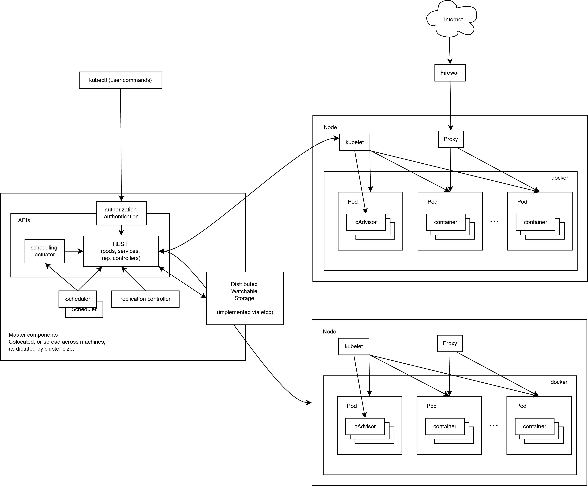

[TOC]

## 一、概述

​	本文档使用二进制手动部署kubernetes集群的所有步骤，不使用kubeadm、ansible等自动化工具来部署，旨在深入理解各个组件工作原理，进而能快速解决生产中问题。 由于使用了 `x509` 证书双向认证、`RBAC` 授权等安全机制，建议从头详细按照文档操作。

若是想自动化部署，参见ansible playbook一键部署：https://github.com/k8sre/k8s.git


## 二、架构




## 三、环境信息

完全按照生产环境架构部署，若仅是测试最小3台机器即可部署。

### 3.1.基础环境

| 名称           | 版本       |
| -------------- | ---------- |
| OS             | CentOS 7.7 |
| Kernel         | 3.10       |
| kubernetes     | v1.16.4    |
| etcd           | v3.3.11    |
| docker-ce      | 19.03      |
| calico         | v3.11      |
| coredns        | 1.6.2      |
| dashboard      | 10.0.1     |
| metrics-server | v0.3.6     |
| harbro         | 1.10.0     |


### 3.2.集群网络

| 名称             | 地址段         |
| ---------------- | -------------- |
| Physical Network | 172.16.90.0/24 |
| Service Network  | 10.64.0.0/16   |
| Pod Network      | 10.80.0.0/12   |

- 规划Pod 和Service IP网段时，建议使用保留私有IP段（Pod IP不与Service IP重复，也不要与主机IP段重复）：
  - Pod 网段
    - A类地址：10.0.0.0/8
    - B类地址：172.16-31.0.0/12-16
    - C类地址：192.168.0.0/16
  - Service网段
    - A类地址：10.0.0.0/16-24
    - B类地址：172.16-31.0.0/16-24
    - C类地址：192.168.0.0/16-24


### 3.3.集群节点

<table>
   <tr>
      <td>Role</td>
      <td>HostName</td>
      <td>IP</td>
      <td>CPU</td>
      <td>MEM</td>
      <td>Disk(数据盘)</td>
      <td>Common</td>
   </tr>
   <tr>
      <td rowspan="3">etcd</td>
      <td>etcd-01</td>
      <td>172.16.90.201</td>
      <td>4</td>
      <td>8</td>
      <td>200G SSD</td>
      <td rowspan="3">尽量使用SSD</td>
   </tr>
   <tr>
      <td>etcd-02</td>
      <td>172.16.90.202</td>
      <td>4</td>
      <td>8</td>
      <td>200G SSD</td>
   </tr>
   <tr>
      <td>etcd-03</td>
      <td>172.16.90.203</td>
      <td>4</td>
      <td>8</td>
      <td>200G SSD</td>
   </tr>
   <tr>
      <td rowspan="3">master</td>
      <td>master-01</td>
      <td>172.16.90.204</td>
      <td>4</td>
      <td>8</td>
      <td>100G SSD</td>
      <td rowspan="3">apiserver域名:apiserver.k8sre.com</td>
   </tr>
   <tr>
      <td>master-02</td>
      <td>172.16.90.205</td>
      <td>4</td>
      <td>8</td>
      <td>100G SSD</td>
   </tr>
   <tr>
      <td>master-03</td>
      <td>172.16.90.206</td>
      <td>4</td>
      <td>8</td>
      <td>100G SSD</td>
   </tr>
   <tr>
      <td rowspan="3">node</td>
      <td>node-01</td>
      <td>172.16.90.207</td>
      <td>16</td>
      <td>32</td>
      <td>500G SSD</td>
      <td>app=addons</td>
   </tr>
   <tr>
      <td>node-02</td>
      <td>172.16.90.208</td>
      <td>16</td>
      <td>32</td>
      <td>500G SSD</td>
      <td>app=addons</td>
   </tr>
     <tr>
      <td>node-03</td>
      <td>172.16.90.209</td>
      <td>16</td>
      <td>32</td>
      <td>500G SSD</td>
      <td>app=addons</td>
   </tr>
   <tr>
      <td rowspan="2">haproxy</td>
      <td>haproxy-01</td>
      <td>172.16.90.198</td>
      <td>8</td>
      <td>16</td>
      <td>100G</td>
      <td>VIP：172.16.90.200</td>
   </tr>
   <tr>
      <td>haproxy-02</td>
      <td>172.16.90.199</td>
      <td>8</td>
      <td>16</td>
      <td>100G</td>
      <td>VIP：172.16.90.200</td>
   </tr>
</table>

⚠️：

- 所有数据保存在etcd中，etcd节点尽量使用ssd磁盘作为etcd数据目录
- haproxy作为apiserver 4层代理，可根据需要更改为其他方式


## 四、系统初始化

### 4.1.前提条件

- 所有机器可以访问互联网，并且内网互通
- 使用root用户进行操作

### 4.2.配置密钥登录

在master-01上生成密钥，并拷贝到其他节点

```
ssh-keygen -t rsa -b 4096 -C kubernetes
ssh-copy-id root@etcd-01
```

- 将etcd-01换成对应主机名

### 4.3.修改主机名

```
hostnamectl set-hostname etcd-01
```

- 将etcd-01换成对应主机名

### 4.4.修改软件源

```
curl -o /etc/yum.repos.d/CentOS-Base.repo https://mirrors.aliyun.com/repo/Centos-7.repo
curl -o /etc/yum.repos.d/epel.repo https://mirrors.aliyun.com/repo/epel-7.repo
yum clean all && yum makecache fast
```

### 4.5.关闭swap

删除/etc/fstab中swap配置，并执行一下命令：

```
swapoff -a
```

### 4.6.关闭防火墙

```
systemctl stop iptables.service
systemctl stop firewalld.service
systemctl disable iptables.service
systemctl disable firewalld.service
```

### 4.7.关闭selinux

```
setenforce 0
sed -i 's@SELINUX=enforcing@SELINUX=disabled@' /etc/selinux/config
```

### 4.8.配置chrony时间服务

```
yum -y install chrony
```

```
cat > /etc/chrony.conf << EOF
server ntp.cloud.aliyuncs.com iburst
server ntp.aliyun.com iburst
stratumweight 0
driftfile /var/lib/chrony/drift
rtcsync
makestep 10 3
bindcmdaddress 127.0.0.1
bindcmdaddress ::1
keyfile /etc/chrony.keys
commandkey 1
generatecommandkey
logchange 0.5
logdir /var/log/chrony
EOF
```

```
systemctl enable chronyd
systemctl restart chronyd
```

```
chronyc tracking
```

虚拟机可以再同步下系统及硬件时钟

```
clock --hctosys
```

### 4.9.安装依赖

```
yum -y install vim wget lrzsz telnet nmap-ncat make net-tools gcc gcc-c++ cmake bash-completion mtr python-devel sshpass conntrack ipvsadm ipset jq libnetfilter_conntrack-devel libnetfilter_conntrack conntrack-tools nscd
```

### 4.10.加载内核模块

```
modprobe ip_vs
modprobe ip_vs_rr
modprobe ip_vs_wrr
modprobe ip_vs_sh
modprobe br_netfilter
modprobe nf_conntrack_ipv4
```

### 4.11.内核优化

```
cat > /etc/sysctl.conf << EOF
kernel.sysrq=1
vm.swappiness = 0
vm.max_map_count=500000
net.core.somaxconn=8192

fs.file-max=655360
fs.nr_open=52706963
fs.inotify.max_user_instances=8192
fs.inotify.max_user_watches=1048576

net.ipv4.ip_forward=1
net.ipv4.neigh.default.gc_stale_time=120
net.ipv4.conf.all.rp_filter=0
net.ipv4.conf.default.rp_filter=0
net.ipv4.conf.default.arp_announce = 2
net.ipv4.conf.lo.arp_announce=2
net.ipv4.conf.all.arp_announce=2
net.ipv4.tcp_max_tw_buckets = 5000
net.ipv4.tcp_syncookies = 1
net.ipv4.tcp_max_syn_backlog = 1024
net.ipv4.tcp_synack_retries = 2
net.ipv6.conf.lo.disable_ipv6 = 1
net.ipv6.conf.all.disable_ipv6 = 1
net.ipv6.conf.default.disable_ipv6 = 1

net.ipv4.tcp_keepalive_time=600
net.ipv4.tcp_keepalive_intvl=30
net.ipv4.tcp_keepalive_probes=10
net.ipv4.tcp_fin_timeout=3
net.ipv4.tcp_max_orphans=655360
net.ipv4.tcp_max_tw_buckets=300000
net.ipv4.ip_local_port_range=20000 60999
net.netfilter.nf_conntrack_max=2310720
net.bridge.bridge-nf-call-iptables=1
net.bridge.bridge-nf-call-ip6tables=1
EOF
```

```
sysctl -p
```


### 4.12.配置journald

```
mkdir /var/log/journal # 持久化保存日志的目录
mkdir /etc/systemd/journald.conf.d
cat > /etc/systemd/journald.conf.d/99-prophet.conf <<EOF
[Journal]
# 持久化保存到磁盘
Storage=persistent
# 压缩历史日志
Compress=yes
SyncIntervalSec=5m
RateLimitInterval=30s
RateLimitBurst=1000
# 最大占用空间 10G
SystemMaxUse=10G
# 单日志文件最大 200M
SystemMaxFileSize=200M
# 日志保存时间 2 周
MaxRetentionSec=2week
# 不将日志转发到 syslog
ForwardToSyslog=no
EOF
systemctl restart systemd-journald
```

### 4.13.挂载数据盘

etcd节点

```
parted /dev/sdb mklabel gpt
parted /dev/sdb "mkpart primary xfs 0 -0"
mkfs.xfs  -n ftype=1 /dev/sdb1
mount /dev/sdb1 /var/lib/etcd
echo "/dev/sdb1 /var/lib/etcd    xfs     defaults,noatime,nodiratime,nobarrier,pquota        0 0" >> /etc/fstab
```

node节点

```
parted /dev/sdb mklabel gpt
parted /dev/sdb "mkpart primary xfs 0 -0"
mkfs.xfs  -n ftype=1 /dev/sdb1
mount /dev/sdb1 /var/lib/docker
echo "/dev/sdb1 /var/lib/docker    xfs     defaults,noatime,nodiratime,nobarrier,pquota        0 0" >> /etc/fstab 
```

### 4.14.创建证书目录

在k8s所有节点创建

```
mkdir -p /etc/kubernetes/pki/
```

### 4.15.分发kubernetes二进制文件

下载kubernetes

```
wget https://dl.k8s.io/v1.16.1/kubernetes-server-linux-amd64.tar.gz
tar zxvf kubernetes-server-linux-amd64.tar.gz
cd kubernetes/server/bin
```

分发master节点

```
scp {kube-apiserver,kube-controller-manager,kube-scheduler,kubectl} ${MASTER}:/usr/bin/
scp {kubelet,kube-proxy} ${NODE}:/usr/bin/
```

- master节点也安装node组件，方便监控、日志、网络等组件调度。

分发node节点

```
scp {kubelet,kube-proxy} ${NODE}:/usr/bin/
```

在所有节点添加执行权限

```
ssh ${IP_ADDR} "chmod +x /usr/bin/kube*"
```

### 4.16.添加kubernetes运行用户

在master节点上执行

```
useradd -u 200 -d /var/kube -s /sbin/nologin kube
```


## 五、部署etcd集群

etcd是CoreOS团队发起的开源项目，基于Go语言实现，作为一个分布式键值对（key-value）存储系统，通过分布式锁，leader选举和写屏障（write barriers）来实现可靠的分布式写作。主要用于服务发现、共享配置以及并发控制等。

特点：

- 简单：支持curl方式的用户API（HTTP+JSON）
- 安全：可选SSL客户端证书认证
- 快速：单实例可达每秒1000次写操作
- 可靠：使用Raft实现分布式

这里部署一个基于TLS（Self-signed certificates）的安全、快速灾难恢复（Disaster Recovery, SNAPSHOT）的高可用（High Availability）的etcd集群。使用TLS证书对证书通信进行加密，并开启基于CA根证书签名的双向数字证书认证。

搭建etcd集群有3种方式，分别为Static, etcd Discovery, DNS Discovery。

### 5.1.签发证书

证书类型介绍：

- server certificate 由服务器使用，并由客户端验证服务器身份。例如docker服务器或kube-apiserver(k8s官网指定的是使用client证书)。
- client certificate 用于通过服务器验证客户端。例如etcdctl、etcd proxy、calico、docker客户端等。
- peer certificate 由 etcd 集群成员使用，供它们彼此之间通信使用。

#### 5.1.1.签发etcd ca证书

准备etcd-ca.cnf

```
[ req ]
req_extensions     = v3_req
distinguished_name = req_distinguished_name

[req_distinguished_name]

[ v3_req ]
keyUsage           = critical, keyCertSign, digitalSignature, keyEncipherment
basicConstraints   = critical, CA:true
```

生成etcd-ca.key

```
openssl genrsa -out etcd-ca.key 4096
```

签发ca

```
openssl req -x509 -new -nodes -key etcd-ca.key -days 1825 -out etcd-ca.pem \
        -subj "/C=CN/ST=Shanghai/L=Shanghai/O=k8sre/CN=etcd-ca" \
        -config etcd-ca.cnf -extensions v3_req
```

验证

```
openssl x509 -noout -text -in etcd-ca.pem
```


#### 5.1.2.签发etcd server证书

准备etcd-server.cnf

```
[ req ]
req_extensions     = v3_req
distinguished_name = req_distinguished_name

[req_distinguished_name]

[ v3_req ]
extendedKeyUsage   = clientAuth, serverAuth
keyUsage           = critical, digitalSignature, keyEncipherment
subjectAltName     = @alt_names

[alt_names]
IP.1 = 127.0.0.1
IP.2 = 172.16.90.201
IP.3 = 172.16.90.202
IP.4 = 172.16.90.203
```

- IP对应etcd节点IP

生成key

```
openssl genrsa -out etcd-server.key 4096
```

生成证书请求

```
openssl req -new -key etcd-server.key -out etcd-server.csr \
        -subj "/C=CN/ST=Shanghai/L=Shanghai/O=k8sre/CN=etcd-server" \
        -config etcd-server.cnf
```

签发证书

```
openssl x509 -req -in etcd-server.csr \
        -CA etcd-ca.pem -CAkey etcd-ca.key -CAcreateserial \
        -out etcd-server.pem -days 1825 \
        -extfile etcd-server.cnf -extensions v3_req
```

校验证书

```
openssl x509  -noout -text -in etcd-server.pem
```


#### 5.1.3.签发etcd client证书

准备etcd-client.cnf

```
[ req ]
req_extensions     = v3_req
distinguished_name = req_distinguished_name

[req_distinguished_name]

[ v3_req ]
extendedKeyUsage   = clientAuth
keyUsage           = critical, digitalSignature, keyEncipherment
```

生成key

```
openssl genrsa -out etcd-client.key 4096
```

生成证书请求

```
openssl req -new -key etcd-client.key -out etcd-client.csr \
        -subj "/C=CN/ST=Shanghai/L=Shanghai/O=system:masters/CN=etcd-client" \
        -config etcd-client.cnf
```

签发证书

```
openssl x509 -req -in etcd-client.csr \
        -CA etcd-ca.pem -CAkey etcd-ca.key -CAcreateserial \
        -out etcd-client.pem -days 1825 \
        -extfile etcd-client.cnf -extensions v3_req
```

校验证书

```
openssl x509  -noout -text -in etcd-client.pem
```


#### 5.1.4.签发etcd peer证书

准备etcd-peer.cnf

```
[ req ]
req_extensions     = v3_req
distinguished_name = req_distinguished_name

[req_distinguished_name]

[ v3_req ]
extendedKeyUsage   = clientAuth, serverAuth
keyUsage           = critical, digitalSignature, keyEncipherment
subjectAltName     = @alt_names

[alt_names]
IP.1 = 127.0.0.1
IP.2 = 172.16.90.201
IP.3 = 172.16.90.202
IP.4 = 172.16.90.203
```

- IP对应etcd节点IP

生成key

```
openssl genrsa -out etcd-peer.key 4096
```

生成证书请求

```
openssl req -new -key etcd-peer.key -out etcd-peer.csr \
        -subj "/C=CN/ST=Shanghai/L=Shanghai/O=k8sre/CN=etcd-peer" \
        -config etcd-peer.cnf
```

签发证书

```
openssl x509 -req -in etcd-peer.csr \
        -CA etcd-ca.pem -CAkey etcd-ca.key -CAcreateserial \
        -out etcd-peer.pem -days 1825 \
        -extfile etcd-peer.cnf -extensions v3_req
```

校验证书

```
openssl x509  -noout -text -in etcd-peer.pem
```


### 5.2.分发etcd证书
分发到etcd节点
```
scp {etcd-ca.pem,etcd-server.pem,etcd-server.key,etcd-client.pem,etcd-client.key,etcd-peer.pem,etcd-peer.key} ${ETCD_IP}:/etc/kubernetes/pki
```
分发到mster节点
```
scp {etcd-ca.pem,etcd-client.pem,etcd-client.key} ${MASTER_IP}:/etc/kubernetes/pki
```


### 5.3.安装etcd

```
yum -y install etcd
```


### 5.4.修改主配置文件

/etc/etcd/etcd.conf

```
[member]
ETCD_NAME=etcd01
ETCD_DATA_DIR="/var/lib/etcd"
ETCD_LISTEN_PEER_URLS="https://172.16.90.201:2380"
ETCD_LISTEN_CLIENT_URLS="https://172.16.90.201:2379"
[cluster]
ETCD_INITIAL_ADVERTISE_PEER_URLS="https://172.16.90.201:2380"
ETCD_INITIAL_CLUSTER="etcd01=https://172.16.90.201:2380,etcd02=https://172.16.90.202:2380,etcd03=https://172.16.90.203:2380"
ETCD_INITIAL_CLUSTER_STATE="new"
ETCD_INITIAL_CLUSTER_TOKEN="etcd-cluster"
ETCD_ADVERTISE_CLIENT_URLS="https://172.16.90.201:2379"
[security]
ETCD_CERT_FILE="/etc/kubernetes/pki/etcd-server.pem"
ETCD_KEY_FILE="/etc/kubernetes/pki/etcd-server.key"
ETCD_TRUSTED_CA_FILE="/etc/kubernetes/pki/etcd-ca.pem"
ETCD_CLIENT_CERT_AUTH="true"
ETCD_PEER_CERT_FILE="/etc/kubernetes/pki/etcd-peer.pem"
ETCD_PEER_KEY_FILE="/etc/kubernetes/pki/etcd-peer.key"
ETCD_PEER_TRUSTED_CA_FILE="/etc/kubernetes/pki/etcd-ca.pem"
ETCD_PEER_CLIENT_CERT_AUTH="true"
```

- 拷贝到对应机器时请将名称、IP修改为对应节点名称、IP


### 5.5.配置systemd unit

/usr/lib/systemd/system/etcd.service

```
[Unit]
Description=Etcd Server
After=network.target
After=network-online.target
Wants=network-online.target

[Service]
Type=notify
WorkingDirectory=/var/lib/etcd/
EnvironmentFile=-/etc/etcd/etcd.conf
User=etcd

ExecStart=/bin/bash -c "GOMAXPROCS=$(nproc) /usr/bin/etcd \
    --name=\"${ETCD_NAME}\" \
    --cert-file=\"${ETCD_CERT_FILE}\" \
    --key-file=\"${ETCD_KEY_FILE}\" \
    --peer-cert-file=\"${ETCD_PEER_CERT_FILE}\" \
    --peer-key-file=\"${ETCD_PEER_KEY_FILE}\" \
    --trusted-ca-file=\"${ETCD_TRUSTED_CA_FILE}\" \
    --peer-trusted-ca-file=\"${ETCD_PEER_TRUSTED_CA_FILE}\" \
    --initial-advertise-peer-urls=\"${ETCD_INITIAL_ADVERTISE_PEER_URLS}\" \
    --listen-peer-urls=\"${ETCD_LISTEN_PEER_URLS}\" \
    --listen-client-urls=\"${ETCD_LISTEN_CLIENT_URLS}\" \
    --advertise-client-urls=\"${ETCD_ADVERTISE_CLIENT_URLS}\" \
    --initial-cluster-token=\"${ETCD_INITIAL_CLUSTER_TOKEN}\" \
    --initial-cluster=\"${ETCD_INITIAL_CLUSTER}\" \
    --initial-cluster-state=\"${ETCD_INITIAL_CLUSTER_STATE}\" \
    --data-dir=\"${ETCD_DATA_DIR}\""

Restart=on-failure
LimitNOFILE=65536

[Install]
WantedBy=multi-user.target
```


### 5.6.配置etcd数据目录

```
mkdir -p /var/lib/etcd
chown -R etcd. /var/lib/etcd
```


### 5.7.启动服务

```
systemctl daemon-reload 
systemctl enable etcd
systemctl restart etcd
```


### 5.8.集群验证

配置启用v3版本API

/etc/profile

```
export ETCDCTL_API=3
```

```
ETCDCTL_API=3 etcdctl \
  --endpoints=https://172.16.90.201:2379,https://172.16.90.202:2379,https://172.16.90.203:2379 \
  --cacert=/etc/kubernetes/pki/etcd-ca.pem \
  --cert=/etc/kubernetes/pki/etcd-client.pem \
  --key=/etc/kubernetes/pki/etcd-client.key \
  endpoint health 
```

查看当前所有的key

```
ETCDCTL_API=3 etcdctl \
  --endpoints=https://172.16.90.201:2379,https://172.16.90.202:2379,https://172.16.90.203:2379 \
  --cacert=/etc/kubernetes/pki/etcd-ca.pem \
  --cert=/etc/kubernetes/pki/etcd-client.pem \
  --key=/etc/kubernetes/pki/etcd-client.key \
  --prefix --keys-only=true get /
```


### 5.9.集群扩容

修改主配置文件

```
ETCD_INITIAL_CLUSTER_STATE="existing"
```

将节点加入集群

```
ETCDCTL_API=3 etcdctl --write-out=table \
  --endpoints=https://172.16.90.201:2379,https://172.16.90.202:2379,https://172.16.90.203:2379 \
  --cacert=/etc/kubernetes/pki/etcd-ca.pem \
  --cert=/etc/kubernetes/pki/etcd-client.pem \
  --key=/etc/kubernetes/pki/etcd-client.key \
  member add etcd04 https://172.16.90.220:2380
```


## 六、签发kube证书
签发证书时，以下字段含义：
```
C            = countryName            /* 国家名(C) */
ST           = stateOrProvinceName    /* 省份(S) */
L            = localityName           /* 城市(LT) */
O            = organizationName       /* 公司(ON) */
OU           = organizationalUnitName /* 部门(OU) */
CN           = commonName             /* 主机名(CN) */
emailAddress =                        /* 邮箱 */
```

证书的一些详情和要求，可以参考官网：https://kubernetes.io/docs/setup/best-practices/certificates/

### 6.1.签发证书

#### 6.1.1.签发ca证书

准备ca.cnf

```
[ req ]
req_extensions         = v3_req
distinguished_name     = req_distinguished_name

[req_distinguished_name]

[ v3_req ]
keyUsage               = critical, cRLSign, keyCertSign, digitalSignature, keyEncipherment
basicConstraints       = critical, CA:true
```

生成ca.key

```
openssl genrsa -out ca.key 4096
```

签发ca

```
openssl req -x509 -new -nodes -key ca.key -days 1825 -out ca.pem \
        -subj "/C=CN/ST=Shanghai/L=Shanghai/O=k8sre/CN=kubernetes" \
        -config ca.cnf -extensions v3_req
```

- CN：kube-apiserver从证书中提取该字段作为请求的用户名（User Name），浏览器使用该字段验证网站是否合法。
- O：kube-apiserver从证书中提取该字段作为请求用户所属的组（Group）。

校验证书

```
openssl x509  -noout -text -in ca.pem
```


#### 6.1.2.签发kubectl证书

准备admin.cnf

```
[ req ]
req_extensions     = v3_req
distinguished_name = req_distinguished_name

[req_distinguished_name]

[ v3_req ]
keyUsage           = critical, digitalSignature, keyEncipherment
extendedKeyUsage   = clientAuth
```

- 该证书只会被 kubectl 当做 client 证书使用，所以`extendedKeyUsage`设置为`clientAuth`

生成key

```
openssl genrsa -out admin.key 4096
```

生成证书请求

```
openssl req -new -key admin.key -out admin.csr \
        -subj "/C=CN/ST=Shanghai/L=Shanghai/O=system:masters/CN=admin" \
        -config admin.cnf
```

- O 为 `system:masters` ，kube-apiserver 收到该证书后将请求的 Group 设置为
  `system:masters`。
- `kube-apiserver` 预定义了一些 `RBAC` 使用的 `RoleBindings`，如 `cluster-admin` 将 Group `system:masters` 与 Role `cluster-admin` 绑定，该 Role 授予了调用`kube-apiserver` 的**所有 API**的权限。

签发admin证书

```
openssl x509 -req -in admin.csr \
        -CA ca.pem -CAkey ca.key -CAcreateserial \
        -out admin.pem -days 1825 \
        -extfile admin.cnf -extensions v3_req
```

校验证书

```
openssl x509  -noout -text -in admin.pem
```


#### 6.1.3.签发kube-apiserver证书

准备kube-apiserver.cnf

```
[ req ]
req_extensions     = v3_req
distinguished_name = req_distinguished_name

[req_distinguished_name]

[ v3_req ]
keyUsage           = critical, digitalSignature, keyEncipherment
extendedKeyUsage   = serverAuth
subjectAltName     = @alt_names

[alt_names]
DNS.1 = kubernetes
DNS.2 = kubernetes.default
DNS.3 = kubernetes.default.svc
DNS.4 = kubernetes.default.svc.cluster
DNS.5 = kubernetes.default.svc.cluster.local
DNS.6 = apiserver.k8sre.com
IP.1 = 127.0.0.1
IP.2 = 172.16.90.204
IP.3 = 172.16.90.205
IP.4 = 172.16.90.206
IP.5 = 172.16.90.200
IP.6 = 10.64.0.1
```

- alt_name下指定授权使用该证书的IP和域名列表，这里列出了master节点IP、HA VIP、apiserver域名、kubernetes服务IP和域名
- kubernetes服务IP是apiserver自动创建的，一般为`--service-cluster-ip-range`参数指定的网段的第一个IP
- IP.6：kubernetes Service ClusterIP
- IP.5：HA VIP，如是使用公有云负载均衡，应为负载均衡IP
- DNS.6：apiserver访问域名

生成key

```
openssl genrsa -out kube-apiserver.key 4096
```

生成证书请求

```
openssl req -new -key kube-apiserver.key -out kube-apiserver.csr \
        -subj "/C=CN/ST=Shanghai/L=Shanghai/O=k8sre/CN=kube-apiserver" \
        -config kube-apiserver.cnf
```

签发证书

```
openssl x509 -req -in kube-apiserver.csr \
        -CA ca.pem -CAkey ca.key -CAcreateserial \
        -out kube-apiserver.pem -days 1825 \
        -extfile kube-apiserver.cnf -extensions v3_req
```

校验证书

```
openssl x509 -noout -text -in kube-apiserver.pem
```


#### 6.1.4.签发kube-apiserver-kubelet-client证书

准备kube-apiserver-kubelet-client.cnf

```
[ req ]
req_extensions     = v3_req
distinguished_name = req_distinguished_name

[req_distinguished_name]

[ v3_req ]
keyUsage           = critical, digitalSignature, keyEncipherment
extendedKeyUsage   = clientAuth
```

生成key

```
openssl genrsa -out kube-apiserver-kubelet-client.key 4096
```

生成证书请求

```
openssl req -new -key kube-apiserver-kubelet-client.key -out kube-apiserver-kubelet-client.csr \
        -subj "/C=CN/ST=Shanghai/L=Shanghai/O=system:masters/CN=kube-apiserver-kubelet-client" \
        -config kube-apiserver-kubelet-client.cnf
```

签发证书

```
openssl x509 -req -in kube-apiserver-kubelet-client.csr \
        -CA ca.pem -CAkey ca.key -CAcreateserial \
        -out kube-apiserver-kubelet-client.pem -days 1825 \
        -extfile kube-apiserver-kubelet-client.cnf -extensions v3_req
```

校验证书

```
openssl x509 -noout -text -in kube-apiserver-kubelet-client.pem
```


#### 6.1.5.签发proxy-client证书

准备proxy-client.cnf

```
[ req ]
req_extensions     = v3_req
distinguished_name = req_distinguished_name

[req_distinguished_name]

[ v3_req ]
keyUsage           = critical, digitalSignature, keyEncipherment
extendedKeyUsage   = clientAuth
```

生成key

```
openssl genrsa -out proxy-client.key 4096
```

生成证书请求

```
openssl req -new -key proxy-client.key -out proxy-client.csr \
        -subj "/C=CN/ST=Shanghai/L=Shanghai/O=k8sre/CN=aggregator" \
        -config proxy-client.cnf
```

- CN名称需要配置在apiserver的`--requestheader-allowed-names`参数中，否则后续访问metrics时会提示权限不足

签发证书

```
openssl x509 -req -in proxy-client.csr \
        -CA ca.pem -CAkey ca.key -CAcreateserial \
        -out proxy-client.pem -days 1825 \
        -extfile proxy-client.cnf -extensions v3_req
```

校验证书

```
openssl x509 -noout -text -in proxy-client.pem
```


#### 6.1.6.签发kube-controller-manager证书

准备kube-controller-manager.cnf

```
[ req ]
req_extensions     = v3_req
distinguished_name = req_distinguished_name

[req_distinguished_name]

[ v3_req ]
keyUsage           = critical, digitalSignature, keyEncipherment
extendedKeyUsage   = clientAuth
```

生成key

```
openssl genrsa -out kube-controller-manager.key 4096
```

生成证书请求

```
openssl req -new -key kube-controller-manager.key -out kube-controller-manager.csr \
        -subj "/C=CN/ST=Shanghai/L=Shanghai/O=system:kube-controller-manager/CN=system:kube-controller-manager" \
        -config kube-controller-manager.cnf
```

- CN和O均为`system:kube-controller-manager`，kubernetes 内置的
  ClusterRoleBindings `system:kube-controller-manager` 赋予 kube-controller-
  manager 工作所需的权限

签发证书

```
openssl x509 -req -in kube-controller-manager.csr \
        -CA ca.pem -CAkey ca.key -CAcreateserial \
        -out kube-controller-manager.pem -days 1825 \
        -extfile kube-controller-manager.cnf -extensions v3_req
```

校验证书

```
openssl x509  -noout -text -in kube-controller-manager.pem
```


#### 6.1.7.签发kube-scheduler证书

准备kube-scheduler.cnf

```
[ req ]
req_extensions     = v3_req
distinguished_name = req_distinguished_name

[req_distinguished_name]

[ v3_req ]
keyUsage           = critical, digitalSignature, keyEncipherment
extendedKeyUsage   = clientAuth
```

生成key

```
openssl genrsa -out kube-scheduler.key 4096
```

生成证书请求

```
openssl req -new -key kube-scheduler.key -out kube-scheduler.csr \
        -subj "/C=CN/ST=Shanghai/L=Shanghai/O=system:kube-scheduler/CN=system:kube-scheduler" \
        -config kube-scheduler.cnf
```

- CN和O均为`system:kube-scheduler`，kubernetes 内置的
  ClusterRoleBindings `system:kube-scheduler` 赋予kube-scheduler工作所需的权限

签发证书

```
openssl x509 -req -in kube-scheduler.csr \
        -CA ca.pem -CAkey ca.key -CAcreateserial \
        -out kube-scheduler.pem -days 1825 \
        -extfile kube-scheduler.cnf -extensions v3_req
```

校验证书

```
openssl x509  -noout -text -in kube-scheduler.pem
```


#### 6.1.8.签发kube-proxy证书

准备kube-proxy.cnf

```
[ req ]
req_extensions     = v3_req
distinguished_name = req_distinguished_name

[req_distinguished_name]

[ v3_req ]
keyUsage           = critical, digitalSignature, keyEncipherment
extendedKeyUsage   = clientAuth
```

生成key

```
openssl genrsa -out kube-proxy.key 4096
```

生成证书请求

```
openssl req -new -key kube-proxy.key -out kube-proxy.csr \
        -subj "/C=CN/ST=Shanghai/L=Shanghai/O=k8sre/CN=system:kube-proxy" \
        -config kube-proxy.cnf
```

- CN：指定该证书的 User 为 `system:kube-proxy` 。
- `kube-apiserver` 预定义的 RoleBinding `system:node-proxier` 将User `system:kube-proxy` 与 Role `system:node-proxier` 绑定，该 Role 授予了调用 `kube-apiserver` Proxy 相关 API 的权限。

签发证书

```
openssl x509 -req -in kube-proxy.csr \
        -CA ca.pem -CAkey ca.key -CAcreateserial \
        -out kube-proxy.pem -days 1825 \
        -extfile kube-proxy.cnf -extensions v3_req
```

校验证书

```
openssl x509  -noout -text -in kube-proxy.pem
```


### 6.2.分发证书

分发master节点证书

```
scp {ca.pem,ca.key,apiserver.pem,apiserver.key,apiserver-kubelet-client.pem,apiserver-kubelet-client.key,proxy-client.pem,proxy-client.key} ${MASTER_IP}:/etc/kubernetes/pki
```

分发node节点证书

```
scp {ca.pem,ca.key} ${NODE_IP}:/etc/kubernetes/pki
```


### 6.3、浏览器访问apiserver

转换证书，安装到系统中

```
openssl pkcs12 -export -out admin.pfx -inkey admin.key -in admin.pem -certfile ca.pem
```


## 七、apiserver高可用配置

### 7.1.安装haproxy

```
yum -y install haproxy
```


### 7.2.配置haproxy

/etc/haproxy/haproxy.cfg

```
global
   log /dev/log local0
   log /dev/log local1 notice
   chroot      /var/lib/haproxy
   pidfile     /var/run/haproxy.pid
   maxconn     4000
   stats timeout 30s
   user        haproxy
   group       haproxy
   daemon
   stats socket /var/lib/haproxy/stats

defaults
    mode                    tcp
    log                     global
    option                  httplog
    option                  dontlognull
    option                  http-server-close
    option                  redispatch
    retries                 3
    timeout connect         5s
    timeout client          30s
    timeout server          30s
    timeout check           2s
    maxconn                 50000

frontend http_stats
   bind *:58080
   mode http
   stats uri /haproxy?stats

frontend haproxy_kube
    bind *:6443
    mode tcp
    option tcplog
    default_backend masters

backend masters
    mode tcp
    option tcplog
    balance roundrobin
    server  master-01  172.16.90.204:6443 check port 6443  inter 1500 rise 1 fall 3
    server  master-02  172.16.90.205:6443 check port 6443  inter 1500 rise 1 fall 3
    server  master-03  172.16.90.206:6443 check port 6443  inter 1500 rise 1 fall 3
```


### 7.3.启动haproxy

```
systemctl enable haproxy
systemctl restart haproxy
```


### 7.4.安装keepalived

```
yum -y install keepalived
```


### 7.5.配置keepalived

/etc/keepalived/keepalived.conf

master:

```
global_defs {
   router_id k8s
   script_user root
   enable_script_security
}

vrrp_script Checkhaproxy {
    script "/etc/keepalived/check_haproxy.sh"
    interval 3
    timeout 9
    fall 2
    rise 2
}

vrrp_instance VI_1 {
    state MASTER
    interface ens160
    virtual_router_id  100
    priority 100
    advert_int 1
    nopreempt
    mcast_src_ip 172.16.90.198
    authentication {
        auth_type PASS
        auth_pass kuburnetes
    }
    unicast_peer {
      172.16.90.198
      172.16.90.199
    }
    virtual_ipaddress {
        172.16.90.200
    }
    track_script {
        Checkhaproxy
    }

}
```

backup

```
global_defs {
   router_id k8s
   script_user root
   enable_script_security
}

vrrp_script Checkhaproxy {
    script "/etc/keepalived/check_haproxy.sh"
    interval 3
    timeout 9
    fall 2
    rise 2
}

vrrp_instance VI_1 {
    state BACKUP
    interface ens160
    virtual_router_id  100
    priority 90
    advert_int 1
    nopreempt
    mcast_src_ip 172.16.90.199
    authentication {
        auth_type PASS
        auth_pass kuburnetes
    }
    unicast_peer {
      172.16.90.198
      172.16.90.199
    }
    virtual_ipaddress {
        172.16.90.200
    }
    track_script {
        Checkhaproxy
    }

}
```
/etc/keepalived/check_haproxy.sh
```
#!/bin/bash
if [ `ps -C haproxy --no-header |wc -l` -eq 0 ] ; then
    systemctl restart haproxy
    sleep 3
    if [ `ps -C haproxy --no-header |wc -l` -eq 0 ] ; then
        systemctl stop keepalived
    fi
fi
```

```
chmod +x /etc/keepalived/check_haproxy.sh
```


### 7.6.启动服务

```
systemctl enable keepalived
systemctl restart keepalived
```


## 八、部署Master节点

master节点运行以下组件：

- kube-apiserver
- kube-controller-manager
- kube-scheduler

1、这三个组件均为无状态，数据存储在etcd中。kube-controller-manager和kube-scheduler会自动选举出一个leader实例，其他实例处于阻塞模式，当leader挂了之后，重新选举出一个新的leader，从而保证服务的可用性。

2、kube-apiserver需要进行代理访问。

### 8.1.配置kubectl

#### 8.1.1.生成kubectl kubeconfig

```
export KUBE_APISERVER="https://apiserver.k8sre.com:6443"
# 设置集群参数
kubectl config set-cluster kubernetes \
  --certificate-authority=ca.pem \
  --embed-certs=true \
  --server=${KUBE_APISERVER}

# 设置客户端认证参数
kubectl config set-credentials admin \
  --client-certificate=admin.pem \
  --client-key=admin.key \
  --embed-certs=true

# 设置上下文参数
kubectl config set-context kubernetes \
  --cluster=kubernetes \
  --user=admin

# 设置默认上下文
kubectl config use-context kubernetes
```

- admin.pem`证书O字段值为`system:masters`，`kube-apiserver` 预定义的 RoleBinding `cluster-admin` 将 Group `system:masters` 与 Role `cluster-admin` 绑定，该 Role 授予了调用`kube-apiserver` 相关 API 的权限。
- --certificate-authority ：验证 kube-apiserver 证书的根证书
- --client-certificate 、 --client-key ：刚生成的 admin 证书和私钥，连
  接 kube-apiserver 时使用
- --embed-certs=true ：将 ca.pem 和 admin.pem 证书内容嵌入到生成的
  kubectl.kubeconfig 文件中(不加时，写入的是证书文件路径，后续拷贝 kubeconfig
  到其它机器时，还需要单独拷贝证书文件，不方便。)
- 生成的 kubeconfig 被保存到 `~/.kube/config` 文件


#### 8.1.2.配置kubectl命令自动补全

/etc/profile

```
source <(kubectl completion bash)
```


### 8.2.安装kube-apiserver

#### 8.2.1.配置apiserver

/etc/kubernetes/apiserver

```
KUBE_API_ARGS="\
    --advertise-address=172.16.90.204 \
    --etcd-servers=https://172.16.90.201:2379,https://172.16.90.202:2379,https://172.16.90.203:2379 \
    --secure-port=6443 \
    --insecure-port=0 \
    --service-account-key-file=/etc/kubernetes/pki/ca.key \
    --tls-cert-file=/etc/kubernetes/pki/kube-apiserver.pem \
    --tls-private-key-file=/etc/kubernetes/pki/kube-apiserver.key \
    --client-ca-file=/etc/kubernetes/pki/ca.pem \
    --etcd-cafile=/etc/kubernetes/pki/etcd-ca.pem \
    --etcd-certfile=/etc/kubernetes/pki/etcd-client.pem \
    --etcd-keyfile=/etc/kubernetes/pki/etcd-client.key \
    --kubelet-certificate-authority=/etc/kubernetes/pki/ca.pem \
    --kubelet-client-certificate=/etc/kubernetes/pki/kube-apiserver-kubelet-client.pem \
    --kubelet-client-key=/etc/kubernetes/pki/kube-apiserver-kubelet-client.key \
    --enable-admission-plugins=NamespaceLifecycle,LimitRanger,ServiceAccount,DefaultStorageClass,ResourceQuota,NodeRestriction \
    --kubelet-preferred-address-types=InternalIP,ExternalIP,Hostname \
    --authorization-mode=RBAC,Node \
    --kubelet-https=true \
    --anonymous-auth=false \
    --apiserver-count=3 \
    --default-not-ready-toleration-seconds=10 \
    --default-unreachable-toleration-seconds=10 \
    --delete-collection-workers=3 \
    --audit-log-maxage=7 \
    --audit-log-maxbackup=10 \
    --audit-log-maxsize=100 \
    --event-ttl=1h \
    --service-cluster-ip-range=10.64.0.0/16 \
    --service-node-port-range=30000-50000 \
    --requestheader-client-ca-file=/etc/kubernetes/pki/ca.pem \
    --proxy-client-cert-file=/etc/kubernetes/pki/proxy-client.pem \
    --proxy-client-key-file=/etc/kubernetes/pki/proxy-client.key \
    --requestheader-allowed-names=aggregator \
    --requestheader-extra-headers-prefix=X-Remote-Extra- \
    --requestheader-group-headers=X-Remote-Group \
    --requestheader-username-headers=X-Remote-User \
    --enable-aggregator-routing=true \
    --max-requests-inflight=3000 \
    --enable-bootstrap-token-auth \
    --logtostderr=true \
    --allow-privileged=true \
    --v=4"
```

- `--advertise-address`：apiserver 对外通告的 IP（kubernetes 服务后端节点 IP）；
- `--default-*-toleration-seconds`：设置节点异常相关的阈值；
- `--max-*-requests-inflight`：请求相关的最大阈值；
- `--etcd-*`：访问 etcd 的证书和 etcd 服务器地址；
- `--experimental-encryption-provider-config`：指定用于加密 etcd 中 secret 的配置；
- `--bind-address`： https 监听的 IP，不能为 `127.0.0.1`，否则外界不能访问它的安全端口 6443；
- `--secret-port`：https 监听端口；
- `--insecure-port=0`：关闭监听 http 非安全端口(8080)；
- `--tls-*-file`：指定 apiserver 使用的证书、私钥和 CA 文件；
- `--audit-*`：配置审计策略和审计日志文件相关的参数；
- `--client-ca-file`：验证 client (kue-controller-manager、kube-scheduler、kubelet、kube-proxy 等)请求所带的证书；
- `--enable-bootstrap-token-auth`：启用 kubelet bootstrap 的 token 认证；
- `--requestheader-*`：kube-apiserver 的 aggregator layer 相关的配置参数，proxy-client & HPA 需要使用；
- `--requestheader-client-ca-file`：用于签名 `--proxy-client-cert-file` 和 `--proxy-client-key-file` 指定的证书；在启用了 metric aggregator 时使用；
- `--requestheader-allowed-names`：不能为空，值为逗号分割的 `--proxy-client-cert-file` 证书的 CN 名称，这里设置为 "aggregator"；
- `--service-account-key-file`：签名 ServiceAccount Token 的公钥文件，kube-controller-manager 的 `--service-account-private-key-file` 指定私钥文件，两者配对使用；
- `--runtime-config=api/all=true`： 启用所有版本的 APIs，如 autoscaling/v2alpha1；
- `--authorization-mode=Node,RBAC`、`--anonymous-auth=false`： 开启 Node 和 RBAC 授权模式，拒绝未授权的请求；
- `--enable-admission-plugins`：启用一些默认关闭的 plugins；
- `--allow-privileged`：运行执行 privileged 权限的容器；
- `--apiserver-count=3`：指定 apiserver 实例的数量；
- `--event-ttl`：指定 events 的保存时间；
- `--kubelet-*`：如果指定，则使用 https 访问 kubelet APIs；需要为证书对应的用户(上面 kubernetes*.pem 证书的用户为 kubernetes) 用户定义 RBAC 规则，否则访问 kubelet API 时提示未授权；
- `--proxy-client-*`：apiserver 访问 metrics-server 使用的证书；
- `--service-cluster-ip-range`： 指定 Service Cluster IP 地址段；
- `--service-node-port-range`： 指定 NodePort 的端口范围；

如果 kube-apiserver 机器**没有**运行 kube-proxy，则还需要添加 `--enable-aggregator-routing=true` 参数；

关于 `--requestheader-XXX` 相关参数，参考：

- https://github.com/kubernetes-incubator/apiserver-builder/blob/master/docs/concepts/auth.md
- https://docs.bitnami.com/kubernetes/how-to/configure-autoscaling-custom-metrics/

注意：

1. requestheader-client-ca-file 指定的 CA 证书，必须具有 client auth and server auth；

2. 如果 `--requestheader-allowed-names` 为空，或者 `--proxy-client-cert-file` 证书的 CN 名称不在 allowed-names 中，则后续查看 node 或 pods 的 metrics 失败，提示：

   ```
   kubectl top nodes
   Error from server (Forbidden): nodes.metrics.k8s.io is forbidden: User "aggregator" cannot list resource "nodes" in API group "metrics.k8s.io" at the cluster scope
   ```


#### 8.2.2.配置systemd unit

/usr/lib/systemd/system/kube-apiserver.service

```
[Unit]
Description=Kubernetes API Server
Documentation=https://github.com/kubernetes/kubernetes
After=network.target
After=etcd.service

[Service]
EnvironmentFile=-/etc/kubernetes/apiserver
User=kube
ExecStart=/usr/bin/kube-apiserver $KUBE_API_ARGS
Restart=on-failure
Type=notify
LimitNOFILE=65536

[Install]
WantedBy=multi-user.target
```


#### 8.2.3.启动kube-apiserver

```
systemctl daemon-reload
systemctl enable kube-apiserver
systemctl restart kube-apiserver
```


#### 8.2.4.查看端口

```
netstat -lntp| grep kube-apiserver
```

- 6443：apiserver端口，接收 https 请求的安全端口，对所有请求做认证和授权；由于关闭了非安全端口，故没有监听 8080。
- 以上端口都提供/metrics和/healthz接口。


### 8.3.安装kube-controller-manager

#### 8.3.1.生成kube-controller-manager kubeconfig

使用以下命令生成kubeconfig文件并拷贝至其他master节点

```
export KUBE_APISERVER="https://apiserver.k8sre.com:6443"

# 设置集群参数
kubectl config set-cluster kubernetes \
  --certificate-authority=ca.pem \
  --embed-certs=true \
  --server=${KUBE_APISERVER} \
  --kubeconfig=kube-controller-manager.kubeconfig

# 设置客户端认证参数
kubectl config set-credentials system:kube-controller-manager \
  --client-certificate=kube-controller-manager.pem \
  --client-key=kube-controller-manager.key \
  --embed-certs=true \
  --kubeconfig=kube-controller-manager.kubeconfig

# 设置上下文参数
kubectl config set-context system:kube-controller-manager \
  --cluster=kubernetes \
  --user=system:kube-controller-manager \
  --kubeconfig=kube-controller-manager.kubeconfig

# 设置默认上下文
kubectl config use-context system:kube-controller-manager --kubeconfig=kube-controller-manager.kubeconfig
```


#### 8.3.2.配置kube-controller-manager

/etc/kubernetes/controller-manager

```
KUBE_CONTROLLER_MANAGER_ARGS="\
    --bind-address=127.0.0.1 \
    --service-account-private-key-file=/etc/kubernetes/pki/ca.key \
    --root-ca-file=/etc/kubernetes/pki/ca.pem \
    --requestheader-client-ca-file=/etc/kubernetes/pki/ca.pem \
    --allocate-node-cidrs=true \
    --cluster-name=kubernetes \
    --cluster-signing-cert-file=/etc/kubernetes/pki/ca.pem \
    --cluster-signing-key-file=/etc/kubernetes/pki/ca.key \
    --leader-elect=true \
    --cluster-cidr=10.80.0.0/12 \
    --service-cluster-ip-range=10.64.0.0/16 \
    --secure-port=10257 \
    --node-monitor-period=2s \
    --node-monitor-grace-period=16s \
    --pod-eviction-timeout=30s \
    --use-service-account-credentials=true \
    --controllers=*,bootstrapsigner,tokencleaner \
    --horizontal-pod-autoscaler-sync-period=10s \
    --kubeconfig=/etc/kubernetes/kube-controller-manager.kubeconfig \
    --authentication-kubeconfig=/etc/kubernetes/kube-controller-manager.kubeconfig \
    --authorization-kubeconfig=/etc/kubernetes/kube-controller-manager.kubeconfig \
    --feature-gates=RotateKubeletServerCertificate=true \
    --logtostderr=true \
    --v=4"
```

- `--secure-port=10257`、`--bind-address=0.0.0.0`: 在所有网络接口监听 10257端口的 https /metrics 请求；
- `--kubeconfig`：指定 kubeconfig 文件路径，kube-controller-manager 使用它连接和验证 kube-apiserver；
- `--authentication-kubeconfig` 和 `--authorization-kubeconfig`：kube-controller-manager 使用它连接 apiserver，对 client 的请求进行认证和授权。`kube-controller-manager` 不再使用 `--tls-ca-file` 对请求 https metrics 的 Client 证书进行校验。如果没有配置这两个 kubeconfig 参数，则 client 连接 kube-controller-manager https 端口的请求会被拒绝(提示权限不足)。
- `--cluster-signing-*-file`：签名 TLS Bootstrap 创建的证书；
- `--experimental-cluster-signing-duration`：指定 TLS Bootstrap 证书的有效期；
- `--root-ca-file`：放置到容器 ServiceAccount 中的 CA 证书，用来对 kube-apiserver 的证书进行校验；
- `--service-account-private-key-file`：签名 ServiceAccount 中 Token 的私钥文件，必须和 kube-apiserver 的 `--service-account-key-file` 指定的公钥文件配对使用；
- `--service-cluster-ip-range` ：指定 Service Cluster IP 网段，必须和 kube-apiserver 中的同名参数一致；
- `--leader-elect=true`：集群运行模式，启用选举功能；被选为 leader 的节点负责处理工作，其它节点为阻塞状态；
- `--controllers=*,bootstrapsigner,tokencleaner`：启用的控制器列表，tokencleaner 用于自动清理过期的 Bootstrap token；
- `--horizontal-pod-autoscaler-*`：custom metrics 相关参数，支持 autoscaling/v2alpha1；
- `--tls-cert-file`、`--tls-private-key-file`：使用 https 输出 metrics 时使用的 Server 证书和秘钥；
- `--use-service-account-credentials=true`: kube-controller-manager 中各 controller 使用 serviceaccount 访问 kube-apiserver；

#### 8.3.3.配置systemd unit

/usr/lib/systemd/system/kube-controller-manager.service

```
[Unit]
Description=Kubernetes Controller Manager
Documentation=https://github.com/kubernetes/kubernetes
After=kube-apiserver.service
Requires=kube-apiserver.service

[Service]
EnvironmentFile=-/etc/kubernetes/controller-manager
User=kube
ExecStart=/usr/bin/kube-controller-manager $KUBE_CONTROLLER_MANAGER_ARGS
Restart=on-failure
LimitNOFILE=65536

[Install]
WantedBy=multi-user.target
```

#### 8.3.4.配置ACL

```
setfacl -m u:kube:r /etc/kubernetes/kube-controller-manager.kubeconfig
```

#### 8.3.5.启动kube-controller-manager

```
systemctl daemon-reload
systemctl enable kube-controller-manager
systemctl restart kube-controller-manager
```

#### 8.3.6.查看端口

```
netstat -lntp| grep kube-controller-manager
```

- 10252：controller-manager端口，接受http请求，非安全端口，不需要认证。
- 10257：controller-manager端口，接受https请求，安全端口，需要认证。
- 以上端口都提供/metrics和/healthz接口。


### 8.4.安装kube-scheduler

#### 8.4.1.生成kube-scheduler kubeconfig

使用以下命令生成kubeconfig文件并拷贝至其他master节点

```
export KUBE_APISERVER="https://apiserver.k8sre.com:6443"

# 设置集群参数
kubectl config set-cluster kubernetes \
  --certificate-authority=ca.pem \
  --embed-certs=true \
  --server=${KUBE_APISERVER} \
  --kubeconfig=kube-scheduler.kubeconfig

# 设置客户端认证参数
kubectl config set-credentials system:kube-scheduler \
  --client-certificate=kube-scheduler.pem \
  --client-key=kube-scheduler.key \
  --embed-certs=true \
  --kubeconfig=kube-scheduler.kubeconfig

# 设置上下文参数
kubectl config set-context system:kube-scheduler \
  --cluster=kubernetes \
  --user=system:kube-scheduler \
  --kubeconfig=kube-scheduler.kubeconfig

# 设置默认上下文
kubectl config use-context system:kube-scheduler --kubeconfig=kube-scheduler.kubeconfig
```


#### 8.4.2.配置kube-scheduler

/etc/kubernetes/scheduler

```
KUBE_SCHEDULER_ARGS="\
    --bind-address=127.0.0.1 \
    --kubeconfig=/etc/kubernetes/kube-scheduler.kubeconfig \
    --authorization-kubeconfig=/etc/kubernetes/kube-scheduler.kubeconfig \
    --authentication-kubeconfig=/etc/kubernetes/kube-scheduler.kubeconfig \
    --leader-elect=true \
    --logtostderr=true \
    --v=4"
```

- --kubeconfig ：指定 kubeconfig 文件路径，kube-scheduler 使用它连接和验证
  kube-apiserver。
- --leader-elect=true ：集群运行模式，启用选举功能；被选为 leader 的节点负
  责处理工作，其它节点为阻塞状态


#### 8.4.3.配置systemd unit

/usr/lib/systemd/system/kube-scheduler.service

```
[Unit]
Description=Kubernetes Scheduler Plugin
Documentation=https://github.com/kubernetes/kubernetes
After=kube-apiserver.service
Requires=kube-apiserver.service

[Service]
EnvironmentFile=-/etc/kubernetes/scheduler
User=kube
ExecStart=/usr/bin/kube-scheduler $KUBE_SCHEDULER_ARGS
Restart=on-failure
LimitNOFILE=65536

[Install]
WantedBy=multi-user.target
```


#### 8.4.4.配置ACL权限

```
setfacl -m u:kube:r /etc/kubernetes/kube-scheduler.kubeconfig
```


#### 8.4.5.启动kube-scheduler

```
systemctl daemon-reload
systemctl enable kube-scheduler
systemctl restart kube-scheduler
```


#### 8.4.6.查看端口

```
netstat -lntp| grep kube-scheduler
```

- 10251：scheduler端口，接受http请求，非安全端口，不需要认证。
- 10259：scheduler端口，接受https请求，安全端口，需要认证。
- 以上端口都提供/metrics和/healthz接口。


### 8.5.检查集群

```
kubectl get componentstatuses
```

查看当前leader

```
kubectl get endpoints kube-controller-manager -n kube-system -o yaml 
kubectl get endpoints kube-scheduler -n kube-system -o yaml
```


## 九、部署Node节点

### 9.1.安装docker

#### 9.1.1.添加docker软件源

/etc/yum.repos.d/docker-ce.repo

```
[docker-ce-stable]
name     = Docker CE Stable - $basearch
baseurl  = http://mirrors.cloud.aliyuncs.com/docker-ce/linux/centos/7/$basearch/stable
	         https://mirrors.aliyun.com/docker-ce/linux/centos/7/$basearch/stable
enabled  = 1
gpgcheck = 1
gpgkey   = https://mirrors.aliyun.com/docker-ce/linux/centos/gpg

[docker-ce-stable-debuginfo]
name     = Docker CE Stable - Debuginfo $basearch
baseurl  = http://mirrors.cloud.aliyuncs.com/docker-ce/linux/centos/7/debug-$basearch/stable
	         https://mirrors.aliyun.com/docker-ce/linux/centos/7/debug-$basearch/stable
enabled  = 1
gpgcheck = 1
gpgkey   = https://mirrors.aliyun.com/docker-ce/linux/centos/gpg


[docker-ce-stable-source]
name     = Docker CE Stable - Sources
baseurl  = http://mirrors.cloud.aliyuncs.com/docker-ce/linux/centos/7/source/stable 
	         https://mirrors.aliyun.com/docker-ce/linux/centos/7/source/stable
enabled  = 1
gpgcheck = 1
gpgkey   = https://mirrors.aliyun.com/docker-ce/linux/centos/gpg
```


#### 9.1.2.安装docker

```
yum list docker-ce --showduplicates | sort -rn
yum -y install docker-ce-18.09.9
systemctl start docker
```


#### 9.1.3.修改docker配置文件

```
cat > /etc/docker/daemon.json << EOF
{
 "registry-mirrors": [
         "https://dockerhub.azk8s.cn",
         "https://docker.mirrors.ustc.edu.cn/"
 ],
 "exec-opts": ["native.cgroupdriver=systemd"],
 "storage-driver": "overlay2",
 "storage-opts":["overlay2.override_kernel_check=true"],
 "log-driver": "json-file",
 "log-opts": {
     "max-size": "500m",
     "max-file": "3"
 },
 "oom-score-adjust": -1000,
 "data-root": "/data/kube/docker"
}
EOF
```

#### 9.1.4.启动docker服务

```
mkdir -p /data/kube/docker
systemctl enable docker
systemctl restart docker
docker info
```


### 9.2. 安装kubelet

#### 9.2.1.生成kubelet bootstrap kubeconfig

使用 Token 时整个启动引导过程:

- 在集群内创建特定的  `Bootstrap Token Secret` ，该 Secret 将替代以前的  `token.csv` 内置用户声明文件 
- 在集群内创建首次 TLS Bootstrap 申请证书的 ClusterRole、后续 renew Kubelet client/server 的 ClusterRole，以及其相关对应的 ClusterRoleBinding；并绑定到对应的组或用户
- 调整 Controller Manager 配置，以使其能自动签署相关证书和自动清理过期的 TLS Bootstrapping Token
- 生成特定的包含 TLS Bootstrapping Token 的  `bootstrap.kubeconfig` 以供 kubelet 启动时使用 
- 调整 Kubelet 配置，使其首次启动加载  `bootstrap.kubeconfig` 并使用其中的 TLS Bootstrapping Token 完成首次证书申请 
- 证书被 Controller Manager 签署，成功下发，Kubelet 自动重载完成引导流程
- 后续 Kubelet 自动 renew 相关证书
- 可选的: 集群搭建成功后立即清除  `Bootstrap Token Secret` ，或等待 Controller Manager 待其过期后删除，以防止被恶意利用

首先建立一个随机产生`BOOTSTRAP_TOKEN`，并建立`bootstrap`的kubeconfig文件

```
TOKEN_PUB=$(openssl rand -hex 3)
TOKEN_SECRET=$(openssl rand -hex 8)
BOOTSTRAP_TOKEN="${TOKEN_PUB}.${TOKEN_SECRET}"

kubectl -n kube-system create secret generic bootstrap-token-${TOKEN_PUB} \
        --type 'bootstrap.kubernetes.io/token' \
        --from-literal description="cluster bootstrap token" \
        --from-literal token-id=${TOKEN_PUB} \
        --from-literal token-secret=${TOKEN_SECRET} \
        --from-literal usage-bootstrap-authentication=true \
        --from-literal usage-bootstrap-signing=true
```

- Token 必须满足  `[a-z0-9]{6}\.[a-z0-9]{16}` 格式；以  `.` 分割，前面的部分被称作  `Token ID` ，  `Token ID` 并不是 “机密信息”，它可以暴露出去；相对的后面的部分称为  `Token Secret` ，它应该是保密的。

使用以下命令生成bootstrap kubeconfig文件并拷贝至其他node节点

```
export KUBE_APISERVER="https://apiserver.k8sre.com:6443"

# 设置集群参数
kubectl config set-cluster kubernetes \
  --certificate-authority=ca.pem \
  --embed-certs=true \
  --server=${KUBE_APISERVER} \
  --kubeconfig=bootstrap.kubeconfig

# 设置客户端认证参数(${BOOTSTRAP_TOKEN}的值为前面token.csv的值)
kubectl config set-credentials kubelet-bootstrap \
  --token=${BOOTSTRAP_TOKEN} \
  --kubeconfig=bootstrap.kubeconfig

# 设置上下文参数
kubectl config set-context default \
  --cluster=kubernetes \
  --user=kubelet-bootstrap \
  --kubeconfig=bootstrap.kubeconfig

# 设置默认上下文
kubectl config use-context default --kubeconfig=bootstrap.kubeconfig
```

- 向 kubeconfig 写入的是 token，bootstrap 结束后 kube-controller-manager 为 kubelet 创建 client 和 server 证书。


#### 9.2.2.配置kubelet

从v1.10版本开始，部分kubelet参数需要在配置文件中配置，建议尽快替换

```
cat > /etc/kubernetes/kubelet.conf << EOF
kind: KubeletConfiguration
apiVersion: kubelet.config.k8s.io/v1beta1
address: 0.0.0.0
cgroupDriver: systemd
cgroupsPerQOS: true
authentication:
  anonymous:
    enabled: false
  webhook:
    enabled: true
    cacheTTL: 2m0s
  x509:
    clientCAFile: "/etc/kubernetes/pki/ca.pem"
authorization:
  mode: Webhook
  webhook:
    cacheAuthorizedTTL: 5m0s
    cacheUnauthorizedTTL: 30s
readOnlyPort: 0
port: 10250
clusterDomain: "cluster.local"
clusterDNS:
  - "10.64.0.2"
configMapAndSecretChangeDetectionStrategy: Watch
containerLogMaxFiles: 5
containerLogMaxSize: 10Mi
contentType: application/vnd.kubernetes.protobuf
cpuCFSQuota: true
cpuCFSQuotaPeriod: 100ms
cpuManagerPolicy: none
cpuManagerReconcilePeriod: 10s
enableControllerAttachDetach: true
enableDebuggingHandlers: true
enableContentionProfiling: true
serverTLSBootstrap: true
enforceNodeAllocatable:
- pods
eventBurst: 10
eventRecordQPS: 5
evictionHard:
  imagefs.available: 15%
  memory.available: 100Mi
  nodefs.available: 10%
  nodefs.inodesFree: 5%
evictionPressureTransitionPeriod: 5m0s
failSwapOn: true
fileCheckFrequency: 20s
hairpinMode: promiscuous-bridge
healthzBindAddress: 127.0.0.1
healthzPort: 10248
httpCheckFrequency: 20s
imageGCHighThresholdPercent: 85
imageGCLowThresholdPercent: 80
imageMinimumGCAge: 2m0s
iptablesDropBit: 15
iptablesMasqueradeBit: 14
kubeAPIBurst: 10
kubeAPIQPS: 5
makeIPTablesUtilChains: true
maxOpenFiles: 1000000
maxPods: 110
nodeLeaseDurationSeconds: 40
nodeStatusReportFrequency: 1m0s
nodeStatusUpdateFrequency: 10s
oomScoreAdj: -999
podPidsLimit: -1
registryBurst: 10
registryPullQPS: 5
resolvConf: /etc/resolv.conf
rotateCertificates: true
runtimeRequestTimeout: 2m0s
serializeImagePulls: true
staticPodPath: /etc/kubernetes/manifests
streamingConnectionIdleTimeout: 4h0m0s
syncFrequency: 1m0s
topologyManagerPolicy: none
volumeStatsAggPeriod: 1m0s
EOF
```

/etc/kubernetes/kubelet

```
KUBELET_ARGS="\
    --hostname-override=172.16.90.204 \
    --config=/etc/kubernetes/kubelet.conf \
    --cgroup-driver=systemd \
    --pod-infra-container-image=gcr.azk8s.cn/google-containers/pause-amd64:3.1 \
    --bootstrap-kubeconfig=/etc/kubernetes/bootstrap.kubeconfig \
    --kubeconfig=/etc/kubernetes/kubelet.kubeconfig  \
    --cert-dir=/etc/kubernetes/pki \
    --root-dir=/data/kube/kubelet \
    --network-plugin=cni \
    --rotate-certificates \
    --runtime-cgroups=/systemd/system.slice \
    --kubelet-cgroups=/systemd/system.slice \
    --logtostderr=true \
    --v=4"
```

- kubelet 启动后使用 --bootstrap-kubeconfig 向 kube-apiserver 发送 CSR 请求，当这个CSR 被 approve 后，kube-controller-manager 为 kubelet 创建 TLS 客户端证书、私钥和 --kubeletconfig 文件。

⚠️：kube-controller-manager 需要配置 --cluster-signing-cert-file 和 --cluster-signing-key-file 参数，才会为 TLS Bootstrap 创建证书和私钥。


#### 9.2.3.配置systemd unit

/usr/lib/systemd/system/kubelet.service

```
[Unit]
Description=Kubernetes Kubelet Server
Documentation=https://github.com/kubernetes/kubernetes
After=docker.service
Requires=docker.service

[Service]
WorkingDirectory=/data/kube/kubelet
EnvironmentFile=-/etc/kubernetes/kubelet
ExecStart=/usr/bin/kubelet $KUBELET_ARGS
Restart=on-failure

[Install]
WantedBy=multi-user.target
```


#### 9.2.4.配置kubelet目录

创建数据目录

```
mkdir -p /data/kube/kubelet
```

创建静态Pod目录

```
mkdir /etc/kubernetes/manifests
```


#### 9.2.5.Bootstrap Token Auth 和授予权限

​	kubelet 启动时查找 --kubeletconfig 参数对应的文件是否存在，如果不存在则使用
--bootstrap-kubeconfig 指定的 kubeconfig 文件向 kube-apiserver 发送证书签名
请求 (CSR)。

​	kube-apiserver 收到 CSR 请求后，对其中的 Token 进行认证，认证通过后将请求的 user 设置为 `system:bootstrap:<Token ID>`，group 设置为 `system:bootstrappers`，这一过程称为 Bootstrap Token Auth。

​	默认情况下，这个 user 和 group 没有创建 CSR 的权限，kubelet 启动失败。

​	解决办法是：创建一个 clusterrolebinding，将 group system:bootstrappers 和 clusterrole system:node-bootstrapper 绑定。

```
kubectl create clusterrolebinding kubelet-bootstrap \
        --clusterrole=system:node-bootstrapper \
        --group=system:bootstrappers
```

- kubelet 启动后使用 --bootstrap-kubeconfig 向 kube-apiserver 发送 CSR 请求，当这个 CSR 被 approve 后，kube-controller-manager 为 kubelet 创建 TLS 客户端证书、私钥和 --kubeletconfig 文件。

- 注意：kube-controller-manager 需要配置 `--cluster-signing-cert-file` 和 `--cluster-signing-key-file` 参数，才会为 TLS Bootstrap 创建证书和私钥。


#### 9.2.6.启动kubelet

```
systemctl daemon-reload
systemctl enable kubelet
systemctl restart kubelet
systemctl status kubelet
```


#### 9.2.7.批准kubelet的TLS请求

##### 9.2.7.1.查看未授权的CSR请求

```
# kubectl get csr
NAME        AGE   REQUESTOR                 CONDITION
csr-kqpth   68s   system:bootstrap:af7fd6   Pending
csr-pp879   75s   system:bootstrap:af7fd6   Pending
csr-qmq6z   80s   system:bootstrap:af7fd6   Pending
```

- 当前均处于Pending状态

##### 9.2.7.2.自动approve CSR请求

创建三个 ClusterRoleBinding，分别用于自动 approve client、renew client、renew server 证书

自动批准 system:bootstrappers 组用户 TLS bootstrapping 首次申请证书的 CSR 请求

```
kubectl create clusterrolebinding auto-approve-csrs-for-group --clusterrole=system:certificates.k8s.io:certificatesigningrequests:nodeclient --group=system:bootstrappers
```

自动批准 system:nodes 组用户更新 kubelet 自身与 apiserver 通讯证书的 CSR 请求

```
kubectl create clusterrolebinding node-client-cert-renewal --clusterrole=system:certificates.k8s.io:certificatesigningrequests:selfnodeclient --group=system:nodes
```

创建自动批准相关 CSR 请求的 ClusterRole

```
kubectl create clusterrole approve-node-server-renewal-csr --verb=create --resource=certificatesigningrequests/selfnodeserver --resource-name=certificates.k8s.io
```

自动批准 system:nodes 组用户更新 kubelet 10250 api 端口证书的 CSR 请求

```
kubectl create clusterrolebinding node-server-cert-renewal --clusterrole=system:certificates.k8s.io:certificatesigningrequests:selfnodeserver --group=system:nodes
```

查看已有绑定

```
kubectl get clusterrolebindings
```

- auto-approve-csrs-for-group：自动 approve  nodeclient 的第一次 CSR； 注意第一次 CSR 时，请求的 Group 为 system:bootstrappers。
- node-client-cert-renewal：自动 approve selfnodeclient  后续过期的证书，自动生成的证书 Group 为 system:nodes。
- node-server-cert-renewal：自动 approve selfnodeserver 后续过期的证书，自动生成的证书 Group 为 system:nodes。

##### 9.2.7.3.查看kubelet情况

```
# kubectl get csr
NAME        AGE     REQUESTOR                   CONDITION
csr-bx5q2   25s     system:node:172.16.90.205   Pending
csr-kqpth   2m9s    system:bootstrap:af7fd6     Approved,Issued
csr-pk69c   17s     system:node:172.16.90.206   Pending
csr-pp879   2m16s   system:bootstrap:af7fd6     Approved,Issued
csr-qmq6z   2m21s   system:bootstrap:af7fd6     Approved,Issued
csr-s588c   30s     system:node:172.16.90.204   Pending
```

- Pending 的 CSR 用于创建 kubelet server 证书，需要手动 approve

基于安全性考虑，CSR approving controllers 不会自动 approve kubelet server 证书签名请求，需要手动 approve

```
kubectl certificate approve csr-bx5q2 csr-pk69c csr-s588c
```

```
# kubectl get csr
NAME        AGE     REQUESTOR                   CONDITION
csr-bx5q2   2m1s    system:node:172.16.90.205   Approved,Issued
csr-kqpth   3m45s   system:bootstrap:af7fd6     Approved,Issued
csr-pk69c   113s    system:node:172.16.90.206   Approved,Issued
csr-pp879   3m52s   system:bootstrap:af7fd6     Approved,Issued
csr-qmq6z   3m57s   system:bootstrap:af7fd6     Approved,Issued
csr-s588c   2m6s    system:node:172.16.90.204   Approved,Issued
```

kube-controller-manager 已经为各个节点生成了kubelet公私钥和kubeconfig

```
ls -la /etc/kubernetes/kubelet.kubeconfig
ls -l /etc/kubernetes/pki/kubelet*
```


#### 9.2.8.查看端口

```
netstat -lntp| grep kubelet
```

- 10248：healthz http 服务。
- 10250：https 服务，访问该端口时需要认证和授权（即使访问 /healthz 也需要），未开启只读端口 10255。
- 以上端口都提供/metrics和/healthz接口。


### 9.3.安装kube-proxy

#### 9.3.1.生成kube-proxy kubeconfig

使用以下命令生成kubeconfig文件并拷贝至其他node节点

```
export KUBE_APISERVER="https://apiserver.k8sre.com:6443"

# 设置集群参数
kubectl config set-cluster kubernetes \
  --certificate-authority=ca.pem \
  --embed-certs=true \
  --server=${KUBE_APISERVER} \
  --kubeconfig=kube-proxy.kubeconfig

# 设置客户端认证参数
kubectl config set-credentials kube-proxy \
  --client-certificate=kube-proxy.pem \
  --client-key=kube-proxy.key \
  --embed-certs=true \
  --kubeconfig=kube-proxy.kubeconfig

# 设置上下文参数
kubectl config set-context default \
  --cluster=kubernetes \
  --user=kube-proxy \
  --kubeconfig=kube-proxy.kubeconfig

# 设置默认上下文
kubectl config use-context default --kubeconfig=kube-proxy.kubeconfig
```

- `--embed-certs=true` ：将 ca.pem 和 admin.pem 证书内容嵌入到生成的
  kubectl-proxy.kubeconfig 文件中(不加时，写入的是证书文件路径)


#### 9.3.2.配置kube-proxy

从v1.10版本开始，kube-proxy参数需要在配置文件中配置

```
cat > /etc/kubernetes/kube-proxy.conf << EOF
apiVersion: kubeproxy.config.k8s.io/v1alpha1
kind: KubeProxyConfiguration
bindAddress: 0.0.0.0
clientConnection:
  acceptContentTypes: ""
  burst: 10
  contentType: application/vnd.kubernetes.protobuf
  kubeconfig: /etc/kubernetes/kube-proxy.kubeconfig
  qps: 5
clusterCIDR: 10.80.0.0/12
configSyncPeriod: 15m0s
conntrack:
  maxPerCore: 32768
  min: 131072
  tcpCloseWaitTimeout: 1h0m0s
  tcpEstablishedTimeout: 24h0m0s
enableProfiling: false
healthzBindAddress: 0.0.0.0:10256
hostnameOverride: "172.16.90.204"
iptables:
  masqueradeAll: false
  masqueradeBit: 14
  minSyncPeriod: 0s
  syncPeriod: 30s
ipvs:
  excludeCIDRs: null
  minSyncPeriod: 2s
  scheduler: wlc
  strictARP: false
  syncPeriod: 30s
metricsBindAddress: 127.0.0.1:10249
mode: ipvs
nodePortAddresses: null
oomScoreAdj: -999
portRange: ""
udpIdleTimeout: 250ms
winkernel:
  enableDSR: false
  networkName: ""
  sourceVip: ""
EOF
```

- `bindAddress`: 监听地址；
- `kubeconfig`: 连接 apiserver 的 kubeconfig 文件；
- `clusterCIDR`: kube-proxy 根据 `--cluster-cidr` 判断集群内部和外部流量，指定 `--cluster-cidr` 或 `--masquerade-all` 选项后 kube-proxy 才会对访问 Service IP 的请求做 SNAT；
- `hostnameOverride`: 参数值必须与 kubelet 的值一致，否则 kube-proxy 启动后会找不到该 Node，从而不会创建任何 ipvs 规则；
- `mode`: 使用 ipvs 模式


#### 9.3.3.配置systemd unit

/usr/lib/systemd/system/kube-proxy.service

```
[Unit]
Description=Kubernetes Kube-Proxy Server
Documentation=https://github.com/kubernetes/kubernetes
After=network.target
Requires=network.service

[Service]
ExecStart=/usr/bin/kube-proxy --config=/etc/kubernetes/kube-proxy.conf
Restart=on-failure
LimitNOFILE=65536

[Install]
WantedBy=multi-user.target
```


#### 9.3.4.启动kube-proxy

```
systemctl daemon-reload
systemctl enable kube-proxy
systemctl restart kube-proxy
```


#### 9.3.4.查看端口

```
netstat -lntp| grep kube-proxy
```

- 10249：http prometheus metrics port。
- 10256：http healthz port。


### 9.4.部署网络插件

#### 9.4.1.部署calico(与flannel任选一种部署)

##### 9.4.1.1.calico简介

Calico组件：

- Felix：Calico agent，运行在每个node节点上，为容器设置网络信息、IP、路由规则、iptables规则等
- etcd：calico后端数据存储
- BIRD：BGP Client，负责把Felix在各个node节点上设置的路由信息广播到Calico网络（通过BGP协议）
- BGP Router Reflector：大规模集群的分级路由分发
- Calico：Calico命令行管理工具


##### 9.4.1.3.配置calico

下载calico yaml

```
curl -O https://docs.projectcalico.org/v3.11/manifests/calico-etcd.yaml
```

修改yaml,以下配置项修改为对应pod地址段

```
typha_service_name: "calico-typha"
```

在`CALICO_IPV4POOL_CIDR`配置下添加一行`IP_AUTODETECTION_METHOD`配置

```
            - name: CALICO_IPV4POOL_CIDR
              value: "10.80.0.0/12"
            - name: IP_AUTODETECTION_METHOD
              value: "interface=ens160"
            - name: CALICO_IPV4POOL_IPIP
              value: "off"
```

将以下配置删除注释，并添加前面etcd-client证书（etcd配置了TLS安全认证，则需要指定相应的ca、cert、key等文件）

```
apiVersion: v1
kind: Secret
type: Opaque
metadata:
  name: calico-etcd-secrets
  namespace: kube-system
data:
  etcd-key: (cat etcd-client.key | base64 -w 0) #将输出结果填写在这里
  etcd-cert: (cat etcd-client.pem | base64 -w 0) #将输出结果填写在这里
  etcd-ca: (cat etcd-ca.pem | base64 -w 0) #将输出结果填写在这里
```
修改configmap
```
kind: ConfigMap
apiVersion: v1
metadata:
  name: calico-config
  namespace: kube-system
data:
  etcd_endpoints: "https://172.16.90.201:2379,https://172.16.90.202:2379,https://172.16.90.203:2379"
  etcd_ca: /calico-secrets/etcd-ca"
  etcd_cert: /calico-secrets/etcd-cert"
  etcd_key: /calico-secrets/etcd-key"
```

ConfigMap部分主要参数：

- etcd_endpoints：Calico使用etcd来保存网络拓扑和状态，该参数指定etcd的地址，可以使用K8S Master所用的etcd，也可以另外搭建。
- calico_backend：Calico的后端，默认为bird。
- cni_network_config：符合CNI规范的网络配置，其中type=calico表示，Kubelet从 CNI_PATH(默认为/opt/cni/bin)找名为calico的可执行文件，用于容器IP地址的分配。

通过DaemonSet部署的calico-node服务Pod里包含两个容器：

- calico-node：calico服务程序，用于设置Pod的网络资源，保证pod的网络与各Node互联互通，它还需要以HostNetwork模式运行，直接使用宿主机网络。
- install-cni：在各Node上安装CNI二进制文件到/opt/cni/bin目录下，并安装相应的网络配置文件到/etc/cni/net.d目录下。

calico-node服务的主要参数：

- CALICO_IPV4POOL_CIDR： Calico IPAM的IP地址池，Pod的IP地址将从该池中进行分配。
- CALICO_IPV4POOL_IPIP：是否启用IPIP模式，启用IPIP模式时，Calico将在node上创建一个tunl0的虚拟隧道。
- FELIX_LOGSEVERITYSCREEN： 日志级别。
- FELIX_IPV6SUPPORT ： 是否启用IPV6。

​     IP Pool可以使用两种模式：BGP或IPIP。使用IPIP模式时，设置 CALICO_IPV4POOL_IPIP="always"，不使用IPIP模式时，设置为"off"，此时将使用BGP模式。

 	IPIP是一种将各Node的路由之间做一个tunnel，再把两个网络连接起来的模式，启用IPIP模式时，Calico将在各Node上创建一个名为"tunl0"的虚拟网络接口。

将以下镜像修改为自己的镜像仓库

```
image: calico/cni:v3.9.1
image: calico/pod2daemon-flexvol:v3.9.1
image: calico/node:v3.9.1
image: calico/kube-controllers:v3.9.1
```

```
kubectl apply -f calico-etcd.yaml
```

主机上会生成了一个tun10的接口

```
# ip route
172.54.2.192/26 via 172.16.90.205 dev tunl0 proto bird onlink
blackhole 172.63.185.0/26 proto bird
# ip route
blackhole 172.54.2.192/26 proto bird
172.63.185.0/26 via 172.16.90.204 dev tunl0 proto bird onlink
```

- 如果设置CALICO_IPV4POOL_IPIP="off" ，即不使用IPIP模式，则Calico将不会创建tunl0网络接口，路由规则直接使用物理机网卡作为路由器转发。


#### 9.4.2.部署Flannel(与calico任选一种部署)

```
wget https://raw.githubusercontent.com/coreos/flannel/master/Documentation/k8s-manifests/kube-flannel-rbac.yml
wget https://raw.githubusercontent.com/coreos/flannel/master/Documentation/k8s-manifests/kube-flannel-legacy.yml
```

修改kube-flannel-legacy，以下配置项修改为对应pod地址段

```
  net-conf.json: |
    {
      "Network": "10.80.0.0/12",
      "Backend": {
        "Type": "vxlan"
      }
    }
```

Flannel支持的后端：

- VXLAN：使用内核中的VXLAN封装数据包。
- host-gw：使用host-gw通过远程机器IP创建到子网的IP路由。
- UDP：如果网络和内核阻止使用VXLAN或host-gw，请仅使用UDP进行调试。
- ALIVPC：在阿里云VPC路由表中创建IP路由，这减轻了Flannel单独创建接口的需要。阿里云VPC将每个路由表的条目限制为50。
- AWS VPC：在AWS VPC路由表中创建IP路由。由于AWS了解IP，因此可以将ELB设置为直接路由到该容器。AWS将每个路由表的条目限制为50。
- GCE：GCE不使用封装，而是操纵IP路由以实现最高性能。因此，不会创建单独的Flannel 接口。GCE限制每个项目的路由为100。
- IPIP：使用内核IPIP封装数据包。IPIP类隧道是最简单的。它具有最低的开销，但只能封装IPv4单播流量，因此您将无法设置OSPF，RIP或任何其他基于组播的协议。

部署Flannel

```
kubectl apply -f kube-flannel-rbac.yml -f kube-flannel-legacy.yml
```

如出现无法跨节点通信，请执行以下命令

```
iptables -P INPUT ACCEPT
iptables -P FORWARD ACCEPT
iptables -F
iptables -L -n
```


### 9.5.验证服务

#### 9.5.1.检查node是否注册

```
kubectl get nodes
ipvsadm -ln
```

- 此时能看到已注册node节点
- 在Node节点上执行`ipvsadm -ln`可以看到kubernetes的Service IP的规则


#### 9.5.2.kubelet提供API接口

如执行`kubectl exec -it nginx-ds-6ghhdf bash`,kube-apiserver会向kubelet发送如下请求：

```
POST /exec/default/nginx-ds-5rmws/my-nginx?command=sh&input=1&output=
1&tty=1
```

kubelet 接收 10250 端口的 https 请求，可以访问如下资源：

- /pods、/runningpods
- /metrics、/metrics/cadvisor、/metrics/probes
- /spec
- /stats、/stats/container
- /logs
- /run/、/exec/, /attach/, /portForward/, /containerLogs/


### 9.6.集群标签配置

为master节点打污点

```
kubectl taint nodes 172.16.90.204 node-role.kubernetes.io/master=:NoSchedule
kubectl taint nodes 172.16.90.205 node-role.kubernetes.io/master=:NoSchedule
kubectl taint nodes 172.16.90.206 node-role.kubernetes.io/master=:NoSchedule
```

为master节点打role标签

```
kubectl label nodes 172.16.90.204 node-role.kubernetes.io/master=
```

为node节点打role标签

```
kubectl label nodes 172.16.90.207 node-role.kubernetes.io/node=
```


## 十、部署集群插件

### 10.1.部署coredns

#### 10.1.1.修改配置文件

在kubernets的二进制中已经有相应的yaml

```
tar zxvf kubernetes-src.tar.gz
cd kubernetes/cluster/addons/dns/coredns
```

修改配置

```
CLUSTER_DNS_DOMAIN="cluster.local"
CLUSTER_DNS_SVC_IP="10.64.0.2"
CLUSTER_DNS_LIMIT_MEMORY="170Mi"

sed -i -e "s@__PILLAR__DNS__DOMAIN__@${CLUSTER_DNS_DOMAIN}@" -e "s@__PILLAR__DNS__SERVER__@${CLUSTER_DNS_SVC_IP}@" -e "s@__PILLAR__DNS__MEMORY__LIMIT__@${CLUSTER_DNS_LIMIT_MEMORY}@" coredns.yaml.base

//gcr.azk8s.cn是Azure中国镜像，建议使用私有镜像仓库
sed -i "s@k8s.gcr.io/coredns:1.6.2@gcr.azk8s.cn/google-containers/coredns:1.6.2@" coredns.yaml.base
```


#### 10.1.2.创建coredns

```
mv coredns.yaml.base coredns.yaml
kubectl apply -f coredns.yaml
```


#### 10.1.3.验证coredns

```
kubectl exec nginx-8458df589f-jq6zh nslookup kube-dns.kube-system.svc.cluster.local.
```


#### 10.1.4.配置外部dns

```
  Corefile: |
    .:53 {
        errors
        health
        kubernetes cluster.local. in-addr.arpa ip6.arpa {
            pods insecure
            upstream
            fallthrough in-addr.arpa ip6.arpa
        }
        prometheus :9153
        proxy . /etc/resolv.conf
        cache 30
        reload
        loadbalance
    }
    .anymb.com {
    forward . 10.0.13.100 10.0.3.162 10.0.3.223
    }
```

绑定hosts

```
        hosts {
            119.3.105.139 ldaps.daocloud.io
            fallthrough
        }
```


### 10.2.部署metrics-server

#### 10.2.1.metrics server简介

​	metrics-server通过kube-apiserver发现所有节点，然后调用kubelet APIs（通过https接口）获得各节点和Pod的CPU、Memory等资源使用情况。

从kubernetes1.12开始，kubernets的安装脚本移除了Heapster，从1.13开始完全移除了对Heapster的支持，heapster不再维护。

替代方案：

- 用于支持自动扩缩容HPA：metrics-server
- 通用的监控方案：Prometheus
- 事件传输：使用第三方工具传输、归档kubernetes events


#### 10.2.2.配置metrics-server

```
git clone https://github.com/kubernetes-incubator/metrics-server.git
cd metrics-server/deploy/1.8+/
```

创建证书的secret

```
kubectl create secret generic metrics-server-certs --from-file=/etc/kubernetes/pki/proxy-client.key --from-file=/etc/kubernetes/pki/proxy-client.pem -n kube-system
```

修改`metrics-server-deployment.yaml` 文件，修改成以下内容

```
    spec:
      serviceAccountName: metrics-server
      volumes:
      - name: metrics-server-certs
        secret:
          secretName: metrics-server-certs
      containers:
      - name: metrics-server
        image: gcr.azk8s.cn/google-containers/metrics-server-amd64:v0.3.6
        args:
          - --secure-port=4443
          - --metric-resolution=30s
          - --tls-cert-file=/certs/proxy-client.pem
          - --tls-private-key-file=/certs/proxy-client.key
          - --kubelet-preferred-address-types=InternalIP,Hostname,InternalDNS,ExternalDNS,ExternalIP
        ports:
        - name: main-port
          containerPort: 4443
          protocol: TCP
        imagePullPolicy: Always
        volumeMounts:
        - name: metrics-server-certs
          mountPath: /certs
```

修改镜像地址（建议修改为私有镜像仓库地址）

```
sed -i "s@k8s.gcr.io/metrics-server-amd64@gcr.azk8s.cn/google-containers/metrics-server-amd64@" metrics-server-deployment.yaml
```

- --metric-resolution=30s：从 kubelet 采集数据的周期。
- --kubelet-preferred-address-types：优先使用 InternalIP 来访问 kubelet，这样可以避免节点名称**没有 DNS 解析**记录时，通过节点名称调用节点 kubelet API 失败的情况（未配置时默认的情况）。


#### 10.2.3.安装metrics-server

```
kubectl create -f .
```


#### 10.2.4.查看输出的metrics

```
kubectl get --raw "/apis/metrics.k8s.io/v1beta1" | jq .
kubectl get --raw "/apis/metrics.k8s.io/v1beta1/nodes" | jq .
kubectl get --raw "/apis/metrics.k8s.io/v1beta1/pods" | jq .
```


#### 10.2.5.查看集群资源

```
kubectl top node
```


### 10.3.部署Ingress-controller

```yaml
apiVersion: v1
kind: Namespace
metadata:
  name: ingress-nginx
  labels:
    app.kubernetes.io/name: ingress-nginx
    app.kubernetes.io/part-of: ingress-nginx

---
apiVersion: apps/v1
kind: Deployment
metadata:
  name: default-http-backend
  labels:
    app: default-http-backend
  namespace: ingress-nginx
spec:
  replicas: 2
  revisionHistoryLimit: 10
  selector:
    matchLabels:
      app: default-http-backend
  template:
    metadata:
      labels:
        app: default-http-backend
    spec:
      affinity:
        nodeAffinity:
          requiredDuringSchedulingIgnoredDuringExecution:
            nodeSelectorTerms:
            - matchExpressions:
              - key: role
                operator: In
                values:
                - gateway
      containers:
      - name: default-http-backend
        # Any image is permissible as long as:
        # 1. It serves a 404 page at /
        # 2. It serves 200 on a /healthz endpoint
        image: gcr.azk8s.cn/google-containers/defaultbackend-amd64:1.5
        imagePullPolicy: "IfNotPresent"
        securityContext:
          runAsUser: 65534
        ports:
        - name: http
          containerPort: 8080
        resources:
          limits:
            cpu: 500m
            memory: 512Mi
          requests:
            cpu: 100m
            memory: 256Mi
        livenessProbe:
          httpGet:
            path: /healthz
            port: 8080
            scheme: HTTP
          initialDelaySeconds: 30
          periodSeconds: 10
          timeoutSeconds: 5
          successThreshold: 1
          failureThreshold: 3
        readinessProbe:
          httpGet:
            path: /healthz
            port: 8080
            scheme: HTTP
          initialDelaySeconds: 0
          periodSeconds: 5
          timeoutSeconds: 5
          successThreshold: 1
          failureThreshold: 6
      terminationGracePeriodSeconds: 60

---
apiVersion: v1
kind: Service
metadata:
  name: default-http-backend
  namespace: ingress-nginx
  labels:
    app: default-http-backend
spec:
  ports:
  - port: 80
    targetPort: 8080
  selector:
    app: default-http-backend

---
kind: ConfigMap
apiVersion: v1
metadata:
  name: nginx-configuration
  namespace: ingress-nginx
  labels:
    app.kubernetes.io/name: ingress-nginx
    app.kubernetes.io/part-of: ingress-nginx
data:
  worker-processes: "8"
  proxy-body-size: "50m"
  #http-redirect-code: "301"
  max-worker-open-files: "65535"
  log-format-upstream: '{"@timestamp":"$time_iso8601", "@source":"$server_addr", "host":"$host", "remote_addr":"$remote_addr", "remote_user":"$remote_user", "remote_port":"$remote_port", "http_x_forwarded_for":"$http_x_forwarded_for", "status":"$status", "request_uri": "$request_uri", "request_time":"$request_time", "request_method":"$request_method", "request_body":"$request_body", "body_bytes_sent":"$body_bytes_sent", "protocol":"$server_protocol", "port":"$server_port", "upstream_status":"$upstream_status", "upstream_response_time":"$upstream_response_time", "upstream_addr":"$upstream_addr", "via":"$http_via", "http_referer":"$http_referer", "http_user_agent":"$http_user_agent"}'
  ssl-protocols: "TLSv1 TLSv1.1 TLSv1.2 TLSv1.3"

---
kind: ConfigMap
apiVersion: v1
metadata:
  name: tcp-services
  namespace: ingress-nginx
  labels:
    app.kubernetes.io/name: ingress-nginx
    app.kubernetes.io/part-of: ingress-nginx

---
kind: ConfigMap
apiVersion: v1
metadata:
  name: udp-services
  namespace: ingress-nginx
  labels:
    app.kubernetes.io/name: ingress-nginx
    app.kubernetes.io/part-of: ingress-nginx

---
apiVersion: v1
kind: ServiceAccount
metadata:
  name: nginx-ingress-serviceaccount
  namespace: ingress-nginx
  labels:
    app.kubernetes.io/name: ingress-nginx
    app.kubernetes.io/part-of: ingress-nginx

---
apiVersion: rbac.authorization.k8s.io/v1beta1
kind: ClusterRole
metadata:
  name: nginx-ingress-clusterrole
  labels:
    app.kubernetes.io/name: ingress-nginx
    app.kubernetes.io/part-of: ingress-nginx
rules:
  - apiGroups:
      - ""
    resources:
      - configmaps
      - endpoints
      - nodes
      - pods
      - secrets
    verbs:
      - list
      - watch
  - apiGroups:
      - ""
    resources:
      - nodes
    verbs:
      - get
  - apiGroups:
      - ""
    resources:
      - services
    verbs:
      - get
      - list
      - watch
  - apiGroups:
      - ""
    resources:
      - events
    verbs:
      - create
      - patch
  - apiGroups:
      - "extensions"
      - "networking.k8s.io"
    resources:
      - ingresses
    verbs:
      - get
      - list
      - watch
  - apiGroups:
      - "extensions"
      - "networking.k8s.io"
    resources:
      - ingresses/status
    verbs:
      - update

---
apiVersion: rbac.authorization.k8s.io/v1beta1
kind: Role
metadata:
  name: nginx-ingress-role
  namespace: ingress-nginx
  labels:
    app.kubernetes.io/name: ingress-nginx
    app.kubernetes.io/part-of: ingress-nginx
rules:
  - apiGroups:
      - ""
    resources:
      - configmaps
      - pods
      - secrets
      - namespaces
    verbs:
      - get
  - apiGroups:
      - ""
    resources:
      - configmaps
    resourceNames:
      # Defaults to "<election-id>-<ingress-class>"
      # Here: "<ingress-controller-leader>-<nginx>"
      # This has to be adapted if you change either parameter
      # when launching the nginx-ingress-controller.
      - "ingress-controller-leader-nginx"
    verbs:
      - get
      - update
  - apiGroups:
      - ""
    resources:
      - configmaps
    verbs:
      - create
  - apiGroups:
      - ""
    resources:
      - endpoints
    verbs:
      - get

---
apiVersion: rbac.authorization.k8s.io/v1beta1
kind: RoleBinding
metadata:
  name: nginx-ingress-role-nisa-binding
  namespace: ingress-nginx
  labels:
    app.kubernetes.io/name: ingress-nginx
    app.kubernetes.io/part-of: ingress-nginx
roleRef:
  apiGroup: rbac.authorization.k8s.io
  kind: Role
  name: nginx-ingress-role
subjects:
  - kind: ServiceAccount
    name: nginx-ingress-serviceaccount
    namespace: ingress-nginx

---
apiVersion: rbac.authorization.k8s.io/v1beta1
kind: ClusterRoleBinding
metadata:
  name: nginx-ingress-clusterrole-nisa-binding
  labels:
    app.kubernetes.io/name: ingress-nginx
    app.kubernetes.io/part-of: ingress-nginx
roleRef:
  apiGroup: rbac.authorization.k8s.io
  kind: ClusterRole
  name: nginx-ingress-clusterrole
subjects:
  - kind: ServiceAccount
    name: nginx-ingress-serviceaccount
    namespace: ingress-nginx

---
apiVersion: apps/v1
kind: DaemonSet
metadata:
  name: nginx-ingress-controller
  namespace: ingress-nginx
  labels:
    app.kubernetes.io/name: ingress-nginx
    app.kubernetes.io/part-of: ingress-nginx
spec:
  revisionHistoryLimit: 10
  selector:
    matchLabels:
      app.kubernetes.io/name: ingress-nginx
      app.kubernetes.io/part-of: ingress-nginx
  template:
    metadata:
      labels:
        app.kubernetes.io/name: ingress-nginx
        app.kubernetes.io/part-of: ingress-nginx
      annotations:
        prometheus.io/port: "10254"
        prometheus.io/scrape: "true"
    spec:
      affinity:
        nodeAffinity:
          requiredDuringSchedulingIgnoredDuringExecution:
            nodeSelectorTerms:
            - matchExpressions:
              - key: role
                operator: In
                values:
                - gateway
      # wait up to five minutes for the drain of connections
      terminationGracePeriodSeconds: 300
      serviceAccountName: nginx-ingress-serviceaccount
      hostNetwork: true
      nodeSelector:
        kubernetes.io/os: linux
      containers:
        - name: nginx-ingress-controller
          image: quay.azk8s.cn/kubernetes-ingress-controller/nginx-ingress-controller:0.26.1
          args:
            - /nginx-ingress-controller
            - --default-backend-service=$(POD_NAMESPACE)/default-http-backend
            - --configmap=$(POD_NAMESPACE)/nginx-configuration
            - --tcp-services-configmap=$(POD_NAMESPACE)/tcp-services
            - --udp-services-configmap=$(POD_NAMESPACE)/udp-services
            - --publish-service=$(POD_NAMESPACE)/ingress-nginx
            - --annotations-prefix=nginx.ingress.kubernetes.io
            - --election-id=ingress-controller-leader
          securityContext:
            allowPrivilegeEscalation: true
            capabilities:
              drop:
                - ALL
              add:
                - NET_BIND_SERVICE
            # www-data -> 33
            runAsUser: 33
          env:
            - name: POD_NAME
              valueFrom:
                fieldRef:
                  fieldPath: metadata.name
            - name: POD_NAMESPACE
              valueFrom:
                fieldRef:
                  fieldPath: metadata.namespace
          ports:
            - name: http
              containerPort: 80
            - name: https
              containerPort: 443
          livenessProbe:
            failureThreshold: 3
            httpGet:
              path: /healthz
              port: 10254
              scheme: HTTP
            initialDelaySeconds: 10
            periodSeconds: 10
            successThreshold: 1
            timeoutSeconds: 10
          readinessProbe:
            failureThreshold: 3
            httpGet:
              path: /healthz
              port: 10254
              scheme: HTTP
            periodSeconds: 10
            successThreshold: 1
            timeoutSeconds: 10
          lifecycle:
            preStop:
              exec:
                command:
                  - /wait-shutdown
          volumeMounts:
          - mountPath: /etc/localtime
            name: tz-config
            readOnly: true
      volumes:
      - name: tz-config
        hostPath:
          path: /etc/localtime
---
apiVersion: v1
kind: Service
metadata:
  labels:
    app.kubernetes.io/name: ingress-nginx
    app.kubernetes.io/part-of: ingress-nginx
  name: ingress-nginx
  namespace: ingress-nginx
spec:
  type: ClusterIP
  ports:
  - name: http
    port: 80
    targetPort: http
    protocol: TCP
  - name: https
    port: 443
    targetPort: https
    protocol: TCP
  selector:
    app.kubernetes.io/name: ingress-nginx
    app.kubernetes.io/part-of: ingress-nginx
```

请自行使用负载均衡器指向到`nginx-ingress-controller`的节点，或者使用haproxy。

```nginx
frontend ingress_http
    bind *:80
    mode tcp
    option tcplog
    default_backend http

backend http
    mode tcp
    option tcplog
    balance roundrobin
    server  ingress-01  172.16.90.207:80 check port 80  inter 1500 rise 1 fall 3
    server  ingress-02  172.16.90.208:80 check port 80  inter 1500 rise 1 fall 3
    server  ingress-03  172.16.90.209:80 check port 80  inter 1500 rise 1 fall 3
    
frontend ingress_https
    bind *:443
    mode tcp
    option tcplog
    default_backend https

backend https
    mode tcp
    option tcplog
    balance roundrobin
    server  ingress-01  172.16.90.207:443 check port 443  inter 1500 rise 1 fall 3
    server  ingress-02  172.16.90.208:443 check port 443  inter 1500 rise 1 fall 3
    server  ingress-03  172.16.90.209:443 check port 443  inter 1500 rise 1 fall 3
```


### 10.4.部署Dashboard

```
kubectl apply -f https://raw.githubusercontent.com/kubernetes/dashboard/v2.0.0-rc3/aio/deploy/recommended.yaml
```

添加证书

```
kubectl create secret tls k8sre-ssl --key k8sre.com.key --cert k8sre.com.pem -n kubernetes-dashboard
```

配置ingress

```yaml
apiVersion: extensions/v1beta1
kind: Ingress
metadata:
  name: kubernetes-dashboard
  namespace: kubernetes-dashboard
  annotations:
    nginx.ingress.kubernetes.io/backend-protocol: HTTPS
spec:
  tls:
  - hosts:
    - dashboard.k8sre.com
    secretName: k8sre-ssl
  rules:
  - host: dashboard.k8sre.com
    http:
      paths:
      - backend:
          serviceName: kubernetes-dashboard
          servicePort: 443
```

配置登录token

```yaml
apiVersion: v1
kind: ServiceAccount
metadata:
  name: admin-k8s
  namespace: kubernetes-dashboard
---
apiVersion: rbac.authorization.k8s.io/v1
kind: ClusterRoleBinding
metadata:
  name: admin-k8s
roleRef:
  apiGroup: rbac.authorization.k8s.io
  kind: ClusterRole
  name: cluster-admin
subjects:
- kind: ServiceAccount
  name: admin-k8s
  namespace: kubernetes-dashboard
```
获取token
```
kubectl -n kubernetes-dashboard get secret $(kubectl -n kubernetes-dashboard get serviceaccount admin-k8s -o jsonpath="{.secrets[0].name}") -o jsonpath="{.data.token}" | base64 --decode
```


### 10.5、部署NPD

#### 10.5.1、概述

​		在kubernetes集群上，通常我们只是管制集群本身以及容器的稳定运行。但是这些稳定性都是强依赖节点node的稳定的。可是node的管理，在kubernetes是比较弱的，因为可能对于kubernetes的初始设计来说，这些应该是IaaS的事。但是随着kubernetes的发展，它越来变成了一个操作系统，它管理的内容将越来越多，所以对于node的管理也将纳入kuberntes里管理。所以延伸出了NPD（Node Problem Detector）。


#### 10.5.2、Node影响kuberntes稳定性的主要因素

- 硬件错误
  - CPU故障
  - Memory故障
  - Disk故障
- Kernel问题
  - kernel deadlock（内核死锁）
  - corrupted file systems (文件系统崩溃)
  - unresponsive runtime daemons (系统运行后台进程无响应)
- Docker问题
  - unresponsive runtime daemons (docker后台进程无响应)
  - docker image error (docker文件系统错误)
- Node问题上报机制
  - NodeCondition(节点状况): 这是指永久性的错误，它将造成pod无法在这个节点运行。这个节点状况只有在节点重启后才会被重置
  - Event(事件): 影响节点的临时性问题，但是它是对于系统诊断是有意义的

NPD就是利用kubernetes的上报机制，通过检测系统的日志（例如centos中journal），把错误的信息上报到kuberntes的node上。


#### 10.5.3、部署NPD

```
apiVersion: v1
kind: ServiceAccount
metadata:
  name: node-problem-detector
  namespace: kube-system
  labels:
    kubernetes.io/cluster-service: "true"
    addonmanager.kubernetes.io/mode: Reconcile
---
apiVersion: rbac.authorization.k8s.io/v1
kind: ClusterRoleBinding
metadata:
  name: npd-binding
  labels:
    kubernetes.io/cluster-service: "true"
    addonmanager.kubernetes.io/mode: Reconcile
roleRef:
  apiGroup: rbac.authorization.k8s.io
  kind: ClusterRole
  name: system:node-problem-detector
subjects:
- kind: ServiceAccount
  name: node-problem-detector
  namespace: kube-system
---
apiVersion: apps/v1
kind: DaemonSet
metadata:
  name: node-problem-detector
  namespace: kube-system
  labels:
    k8s-app: node-problem-detector
    kubernetes.io/cluster-service: "true"
    addonmanager.kubernetes.io/mode: Reconcile
spec:
  selector:
    matchLabels:
      k8s-app: node-problem-detector
  template:
    metadata:
      labels:
        k8s-app: node-problem-detector
        kubernetes.io/cluster-service: "true"
    spec:
      containers:
      - name: node-problem-detector
        image: gcr.azk8s.cn/google-containers/node-problem-detector:v0.6.3
        command:
        - "/bin/sh"
        - "-c"
        # Pass both config to support both journald and syslog.
        - "exec /node-problem-detector --logtostderr --system-log-monitors=/config/kernel-monitor.json,/config/kernel-monitor-filelog.json,/config/docker-monitor.json,/config/docker-monitor-filelog.json >>/var/log/node-problem-detector.log 2>&1"
        securityContext:
          privileged: true
        resources:
          limits:
            cpu: "200m"
            memory: "100Mi"
          requests:
            cpu: "20m"
            memory: "20Mi"
        env:
        - name: NODE_NAME
          valueFrom:
            fieldRef:
              fieldPath: spec.nodeName
        volumeMounts:
        - name: log
          mountPath: /var/log
        - name: localtime
          mountPath: /etc/localtime
          readOnly: true
      volumes:
      - name: log
        hostPath:
          path: /var/log/
      - name: localtime
        hostPath:
          path: /etc/localtime
          type: "FileOrCreate"
      serviceAccountName: node-problem-detector
      tolerations:
      - operator: "Exists"
        effect: "NoExecute"
      - key: "CriticalAddonsOnly"
        operator: "Exists"

```


## 十一、HPA

Horizontal Pod Autoscaling，简称HPA，是Kubernetes中实现POD水平自动伸缩的功能。为什么要水平而不叫垂直, 那是因为自动扩展主要分为两种:

- 水平扩展(scale out)，针对于实例数目的增减
- 垂直扩展(scal up)，即单个实例可以使用的资源的增减, 比如增加cpu和增大内存


而HPA属于前者。它可以根据CPU使用率或应用自定义metrics自动扩展Pod数量(支持 replication controller、deployment 和 replica set)。

获取metrics的两种方式：

- Metrics Server：提供CPU、MEM、网络流量、QPS等度量指标。
- Cousom：涉及到自定义的REST API的开发，复杂度会比较大，并且当需要从自定义的监控中获取数据时，只能设置绝对值，无法设置使用率。


配置HPA示例

```
apiVersion: autoscaling/v2beta2
kind: HorizontalPodAutoscaler
metadata:
  name: hpa-coredns
  namespace: kube-system
spec:
  scaleTargetRef:
    apiVersion: apps/v1
    kind: Deployment
    name: coredns
  minReplicas: 2
  maxReplicas: 10
  metrics:
  - type: Resource
    resource:
      name: cpu
      target:
        type: Utilization
        averageUtilization: 50
  - type: Pods
    pods:
      metric:
        name: packets-per-second
      targetAverageValue: 1k
  - type: Object
    object:
      metric:
        name: requests-per-second
      describedObject:
        apiVersion: networking.k8s.io/v1beta1
        kind: Ingress
        name: coredns
      target:
        kind: Value
        value: 10k
```

查询此api用法

```
kubectl explain hpa.spec --api-version=autoscaling/v2beta2
```


## 十二、RBAC

### 12.1.创建受限账户

#### 12.1.1.为zhangsan签发证书

准备zhangsan.cnf

```
[ req ]
req_extensions     = v3_req
distinguished_name = req_distinguished_name

[req_distinguished_name]

[ v3_req ]
keyUsage           = critical, digitalSignature, keyEncipherment
extendedKeyUsage   = clientAuth
subjectAltName     = @alt_names

[alt_names]
IP.1 = 172.16.90.204
```

- 此证书仅在`alt_names`指定IP的机器上生效。如不限制，可将`alt_names`相关配置删除。

生成key

```
openssl genrsa -out zhangsan.key 4096
```

生成证书请求

```
openssl req -new -key zhangsan.key -out zhangsan.csr \
        -subj "/CN=zhangsan/OU=System/C=CN/ST=Shanghai/L=Shanghai/O=k8s" \
        -config zhangsan.cnf
```

- CN 设置为用户名 ，kubernetes收到该证书请求后，会使用此字段名与ClusterRoleBinding进行验证。

签发证书

```
openssl x509 -req -in zhangsan.csr \
        -CA ca.pem -CAkey ca.key -CAcreateserial \
        -out zhangsan.pem -days 1825 \
        -extfile zhangsan.cnf -extensions v3_req
```

校验证书

```
openssl x509  -noout -text -in zhangsan.pem
```


#### 12.1.2.为zhangsan生产kubeconfig

```
export KUBE_APISERVER="https://apiserver.k8sre.com:6443"
# 设置集群参数
kubectl config set-cluster kubernetes \
  --certificate-authority=ca.pem \
  --embed-certs=true \
  --server=${KUBE_APISERVER} \
  --kubeconfig=zhangsan.kubeconfig

# 设置客户端认证参数
kubectl config set-credentials zhangsan \
  --client-certificate=zhangsan.pem \
  --client-key=zhangsan.key \
  --embed-certs=true \
  --kubeconfig=zhangsan.kubeconfig
  
# 设置上下文参数
kubectl config set-context kubernetes \
  --cluster=kubernetes \
  --user=zhangsan \
  --kubeconfig=zhangsan.kubeconfig

# 设置默认上下文
kubectl config use-context kubernetes --kubeconfig=zhangsan.kubeconfig
```

- 如需指定默认使用的namespace，请在设置上下文参数中增加`--namespace=${NAMESPACE}`参数。


#### 12.1.3.配置RBAC权限

zhangsan-rbac.yaml

```
apiVersion: v1
kind: ServiceAccount
metadata:
  name: user-zhangsan
  namespace: kube-system
---
kind: Role
apiVersion: rbac.authorization.k8s.io/v1
metadata:
  namespace: kube-system
  name: user-zhangsan
rules:
- apiGroups: [""]
  resources: ["pods", "pods/log", "services", "replicationcontrollers"]
  verbs:     ["get", "watch", "list"]
# Allow user into pod by 'exec'
- apiGroups: [""]
  resources: ["pods/exec"]
  verbs:     ["create"]
- apiGroups: ["extensions", "apps"]
  resources: ["deployments", "replicasets", "statefulsets"]
  verbs:     ["get", "list", "watch"]
- apiGroups: ["batch"]
  resources: ["cronjobs", "jobs"]
  verbs:     ["get", "list", "watch"]
---
kind: RoleBinding
apiVersion: rbac.authorization.k8s.io/v1
metadata:
  name: user-zhangsan
  namespace: kube-system
subjects:
- kind: User
  name: zhangsan
  apiGroup: rbac.authorization.k8s.io
roleRef:
  kind: Role
  name: user-zhangsan
  apiGroup: rbac.authorization.k8s.io
```


#### 12.1.4.创建RBAC权限

```
kubectl apply -f zhangsan-rbac.yaml
```

将zhangsan.kubeconfig拷贝至对应用的.kube/config

```
cp -rf zhangsan.kubeconfig /home/zhangsan/.kube/config
```

切换至zhangsan用户，即可使用此权限。


#### 12.1.5.dashboard访问

获取token

```
kubectl -n kube-system get secret $(kubectl -n kube-system get serviceaccount user-zhangsan -o jsonpath="{.secrets[0].name}") -o jsonpath="{.data.token}" | base64 --decode
```

使用此token登陆dashboard即可。


