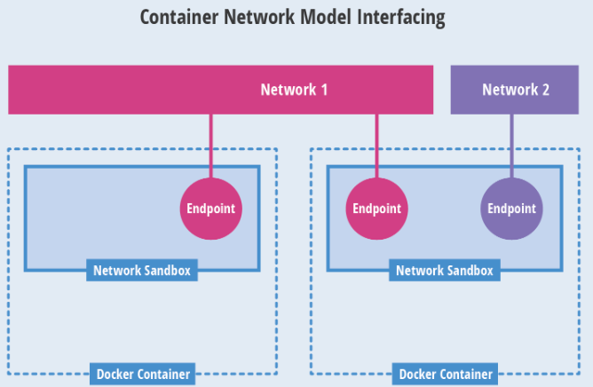
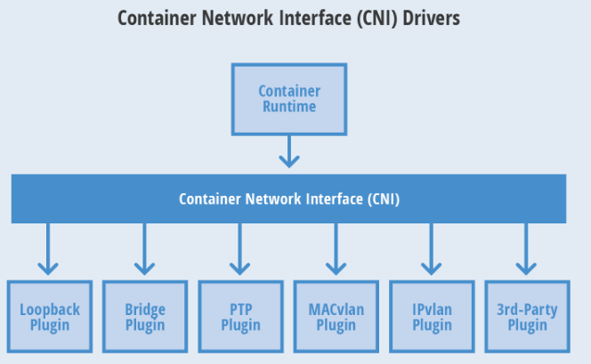

## 二、CNI网络模型

​		随着容器技术在企业生产系统中的逐步落地，用户对容器云的网络特性要求也越来越高。跨主机容器间的网络互通已经成为基本要求，更高的要求包括容器固定IP地址、一个容器多个IP地址、多个子网隔离、ACL控制策略、与SDN集成等。目前主流的容器网络模型主要有Docker公司提出的`CNM（Container Network Model）`模型和CoreOS公司提出的`CNI（Container Network Interface）`模型。

### 2.1、CNM模型

​		CNM模型是由Docker公司提出的容器网络模型，现在已经被Cisco Contiv、Kuryr、Open Virtual Network（OVN）、Project Calico、VMware、Weave和Plumgrid等项目所采纳。另外，Weave、Project Calico、Kuryr和Plumgrid等项目也为CNM提供了网络插件的具体实现。

CNM模型主要通过`Network Sandbox`、`Endpoint`和`Network`这3个组件进行实现。



- Network Sandbox：容器内部的网络栈，包括网络接口、路由表、DNS等配置的管理。一个Sandbox可以包含多个Endpoint。
- Endpoint：用于将容器内的Sandbox与外部网络相连的网络接口。可以使用veth对、Open vSwitch的内部Port等技术进行实现。一个Endpoint仅能够加入一个Network。
- Network：可以直接互连的Endpoint的集合。可以通过LInux网桥、VlAN等技术进行实现。一个Network包含多个Endpoint。


### 2.2、CNI模型

​		CNI是由CoreOS公司提出的另一种容器网络规范，现在已经被Kubernetes、rkt、Apache Mesos、Cloud Foundry和Kurma等项目采纳。另外，Contiv Networking、Project Calico、Weave、SR-IOV、Cilium、Infoblox、Multus、Romana、Plumgrid和Midokura等项目也为CNI提供网络插件的具体实现。



​		CNI定义的是容器运行环境与网络插件之间的简单接口规范，通过一个JSON Schema定义CNI插件提供的输入和输出参数。一个容器可以通过绑定多个网络插件加入多个网络中。


#### 2.2.1、CNI规范

​		CNI提供了一种应用容器的插件化网络解决方案，定义对容器网络进行操作和配置的规范，通过插件的形式对CNI接口进行实现。CNI是由rkt Networking Proposal发展而来的，试图提供一种通用的容器网络解决方案。CNI仅关注在创建容器时分配网络资源，和在销毁容器时删除网络资源，这使得CNI规范非常轻巧、易于实现，得到了广泛的支持。

在CNI模型中只涉及两个概念：

- 容器（Container）：拥有独立Linux网络命名空间的环境。
- 网络（Network）：表示可以互连的一组实体，这些实体拥有各自独立、唯一的IP，可以是容器、物理机或者其他网络设备等。

​       对容器网络的设置和操作都通过插件进行具体实现，CNI插件包括两种类型：CNI Plugin和IPAM（IP Address Management）Plugin。CNI Plugin负责为容器配置网络资源，IPAM Plugin作为CNI Plugin的一部分，与CNI Plugin一起工作。


#### 2.2.2、CNI Plugin插件

​		CNI Plugin包括3个基本接口的定义：添加（ADD）、删除（DELETE）、检查（CHECK）和版本查询（VERSION）。这些接口的具体实现要求插件提供一个可执行的程序，在容器网络添加或删除时进行调用，以完成具体的操作。

（1）**添加**：将容器添加到某个网络。主要过程为在Container Runtime创建容器时，先创建好容器内的网络命名空间，然后调用CNI插件为netns进行网络配置，最后启动容器内的进程。

添加接口的参数：

- Version：CNI版本号。
- Container ID：容器ID。
- Network namespace path：容器的网络命名空间路径，例如：/proc/[pid]/ns/net。
- Network configuration：网络配置JSON文档，用于描述容器待加入的网络。
- Extra arguments：其他参数，提供基于容器的CNI插件简单配置机制。
- Name of the interface inside the container：容器内的网卡名。

返回信息如下：

- Interfaces list：网卡列表，根据Plugin的实现，可能包括Sandbox Interface名称、主机Interface名称、每个Interface的地址等信息。
- IPs assigned to the interface：IPv4或IPv6地址、网关地址、路由信息等。
- DNS information：DNS相关信息。


（2）**删除**：容器销毁时将容器从某个网络中删除。

删除接口参数：

- Version：CNI版本号。
- Container ID： 容器ID。
- Network namespace path：容器的网络命名空间路径，例如：/proc/[pid]/ns/net。
- Network configuration：网络配置JSON文档，用于描述容器待加入的网络。
- Extra arguments：其他参数，提供基于容器的CNI插件简单配置机制。
- Name of the interface inside the container：容器内的网卡名。


（3）**检查**：检查容器网络是否正确设置。

检查接口参数：

- Container ID： 容器ID。
- Network namespace path：容器的网络命名空间路径，例如：/proc/[pid]/ns/net。
- Network configuration：网络配置JSON文档，用于描述容器待加入的网络。
- Extra arguments：其他参数，提供基于容器的CNI插件简单配置机制。
- Name of the interface inside the container：容器内的网卡名。


（4）**版本查询**：查询网络插件支持的CNI规范版本号。

无参数，返回值为网络插件支持的CNI规范版本号。


​		CNI插件应能够支持通过环境变量和标准输入传入参数。可执行文件通过网络配置参数重的type字段标书的文件名在环境变量CNI_PATH设定的路径下进行查找。一旦找到，容器运行时将调用该克执行程序，并传入以下环境变量和网络配置参数，供该插件完成容器网络资源和参数的设置。

环境变量参数：

- CNI_COMMAND：接口方法，包括ADD、DEL、VERSION。
- CNI_CONTAINERID：容器ID。
- CNI_NETNS：容器的网络命名空间路径，例如：/proc/[pid]/ns/net。
- CNI_IFNAME：待设置的网络接口名称。
- CNI_ARGS：其他参数，key=value格式，多个参数用分号分割。
- CNI_PATH：可执行文件的查找路径，可以设置多个。

网络配置参数：

- cniVersion：string，CNI版本号。
- name：string，网络名称，应在一个管理域内唯一。
- type：string，CNI插件的可执行文件的名称。
- args：dictionary，其他参数
- ipMasq：boolean，是否设置IP Masquerade（需要插件支持），适用于主机可作为网关的环境中。
- ipam： IP地址管理的相关配置。
  - type：string，IPAM可执行的文件名。
- dns：DNS服务的相关配置。
  - nameservices：list of strings，名字服务器列表，可以使用IPv4或IPv6.
  - domain：string，本地域名，用于短主机名查询。
  - search：list of stings，按优先级排序的域名查询列表。
  - options：list of strings：传递给resolver的选项列表。


#### 2.2.3、IPAM Plugin

​		为了减轻CNI Plugin对IP地址管理的负担，在CNI规范中设置了一个新的插件专门用于管理容器的IP地址（还包括网关、路由等信息），被称为IPAM Plugin，通常由CNI Plugin在运行时自动调用IPAM Plugin完成容器IP地址的分配。

​		IPAM Plugin负责为容器分配IP地址、网关、路由和DNS，典型的实现包括host-local和dhcp。与CNI Plugin类似，IPAM Plugin也通过可执行程序完成IP地址分配的具体操作。IPAM可执行程序也处理传递给CNI插件的环境变量和通过标准输入（stdin）传入的网络配置参数。

如果成功完成了容器IP地址的分配，则IPAM插件应该通过标准输出（stdout）返回以下JSON报文：

```json
{
  "cniVersion": "0.4.0",
  "ips": [
    {
      "version": "<4-or-6>",
      "address": "<ip-and-prefix-in-CIDR>",
      "gateway": "<ip-address-of-the-gateway>"        (optional)
    },
    ......
  ],
  "routes": [                                         (optional)
    {
      "dst": "<ip-and-prefix-in-cidr>",
      "gw": "<ip-of-next-hop>"                        (optional)
    },
    ......
  ],
  "dns": {
    "nameservers": "<list-of-nameservers>",           (optional)
    "domain": "<name-of-local-domain>",               (optional)
    "search": "<list-of-search-domain>",              (optional)
    "options": "<list-of-options>"                    (optional)
  }
}
```

- ips段：分配给容器的IP（也可能包含网关）。
- routes段：路由规则记录
- dns段：DNS相关信息


#### 2.2.4、多网络插件

​		在很多情况下，一个容器需要连接多个网络，CNI规范支持为一个容器运行多个CNI Plugin来实现这个目标。多个网络插件将按照网络配置列表中的顺序执行，并将前一个网络配置的执行结果传递给后面的网络配置。多网络配置用JSON报文进行配置，包括如下信息：

- cniVersion：string，CNI版本号。
- name：string，网络名称，应在一个管理域内唯一，将用于下面的所有Plugin。
- plugins：list，网络配置列表。


### 2.3、使用网络插件

Kubernetes目前支持两种网络插件的实现：

- CNI插件：根据CNI规范实现其接口，以与插件提供者进行对接。
- kubenet插件：使用bridge和host-local CNI插件实现一个基本的cbr0。


为了在kubernetes集群中使用网络插件，需要在kubelet服务的启动参数上设置以下参数：

- `--network-plugin-dir`：kuberlet启动时扫描网络插件的目录。
- `--network-plugin`：网络插件名称，对与CNI插件，设置为cni即可，无需关注--network-plugin-dir的路径。对于kubenet插件，目前仅实现了一个最简单的cbr0 Linux网桥。

在`--network-plugin=cni`时，kubelet还需要设置以下参数：

- `--cni-conf-dir`：CNI插件的配置文件目录，默认为`/etc/cni/net.d`。该目录下配置文件的内容需要符合CNI规范。
- `--cni-bin-dir`：CNI插件的可执行文件目录，默认为`/opt/cni/bin`。