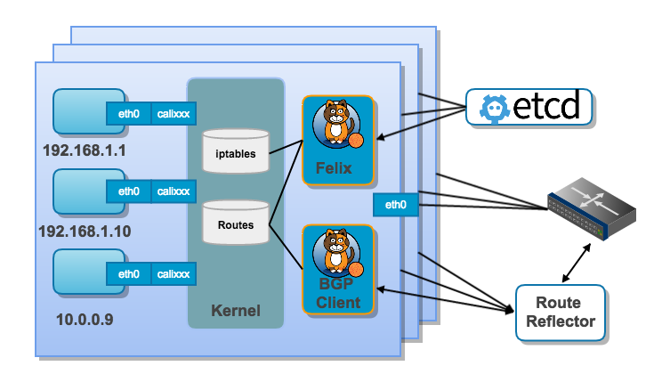

## 五、Calico

### 5.1、概述

​		Calico是一个基于BGP的纯三层的网络方案，没有使用覆盖网络驱动。Calico在每个计算节点都利用Linux Kernel实现了一个高效的vRouter来负责数据转发，每个vRouter都通过BGP1协议把在本节点上运行的容器的路由信息向整个Calico网络广播，并自动设置到达其他节点的路由转发规则。

### 5.2、工作原理

​		Calico保证所有容器之间的数据流量都是通过IP路由的方式完成互联互通的。Calico节点组网时可以直接利用数据中心的网络结构（L2或L3），不需要额外的NAT、隧道或者Overlay Network，没有额外的封包解包，能够节约CPU运算，提高网络效率。

​		另外，Calico基于iptables还提供了丰富而灵活的网络policy，保证通过各个节点上的ACLs来提供workload的多租户隔离、安全组以及其他可达性限制等功能。

​		每个主机上都部署了calico/node作为虚拟路由器，并且可以通过calico将宿主机组织成任意的拓扑集群。当集群中的容器需要与外界通信时，就可以通过BGP协议将网关物理路由器加入到集群中，使外界可以直接访问容器IP，而不需要做任何NAT之类的复杂操作。

​		当容器创建时，calico为容器生成veth pair，一端作为容器网卡加入到容器的网络命名空间，并设置IP和掩码，一端直接暴露在宿主机上，并通过设置路由规则，将容器IP暴露到宿主机的通信路由上。于此同时，calico为每个主机分配了一段子网作为容器可分配的IP范围，这样就可以根据子网的CIDR为每个主机生成比较固定的路由规则。

### 5.3、组件

- Felix：Calico agent，运行在每个Node上，主要负责为容器配置网络资源（IP地址、路由规则、iptables规则等），保证跨主机容器网络互通。
- etcd：Calico使用的后端存储，主要负责网络元数据一致性，确保calico网络状态的准确性。
- BGP Client：主要负责把Felix写入内核的路由信息通过BGP协议广播到calico网络。
- Route Reflector：通过一个或多个BGP Route Reflector来完成大规模集群的分级路由分发。
- Calico Ctl：Calico的命令后管理工具。

​		Calico默认使用node-to-node-mesh模式，使用BGP模式下的node-to-node-mesh全节点互联，这种在小规模集群还可用。但是随着集群规模扩大，因为node-to-node-mesh模式要求所有的Node节点都用互联，BGP的mesh会变得混乱。所以大规模集群使用BGP route reflector，集中式的路由信息分发，当Calico BGP客户端将路由从其FIB通告到Route Reflector时，Route Reflector会将这些路由通告给集群中的其他节点。

### 5.4、网络方式

#### 5.4.1、IPIP

​		IPIP是一种将各Node的路由之间做一个tunnel，再把两个网络连接起来的模式。启用IPIP模式时，Calico将在各Node上创建一个名为”tunl0″的虚拟网络接口。

#### 5.4.2、BGP

​		BGP模式则直接使用物理机作为虚拟路由路（vRouter），不再创建额外的tunnel。

