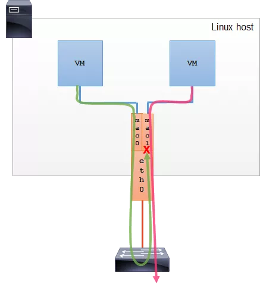
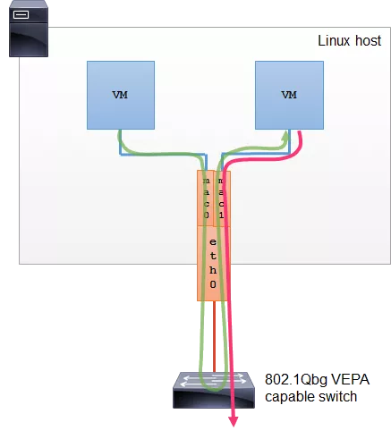
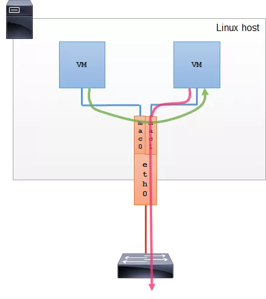
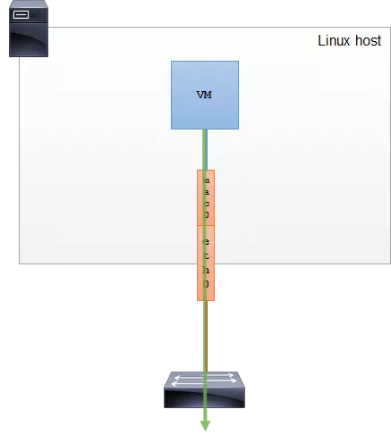

## 六、Macvlan

### 6.1、概述

​		Macvlan是Linux操作系统内核提供的网络虚拟化方案之一，更准确的说法是网卡虚拟化方案。它可以为一张物理网卡设置多个mac地址，相当于物理网卡使用了影分身之术，由一个变多个，同时要求物理网卡打开混杂模式。针对每个mac地址，都可以设置IP地址，本来是一块物理网卡连接到交换机，现在是多块虚拟网卡连接到交换机。


### 6.2、工作原理

​		Macvlan是LInux kernel支持的新特性，支持的版本有v3.9-3.19和4.0+，比较稳定的版本推荐4.0+。它一般是以内核模块的形式存在。可以使用以下命令判断当前系统是否支持：

```
modprobe macvlan
lsmod | grep macvlan
```

​		Macvlan听起来有点像VLAN，但它们的实现机制是完全不一样的。Macvlan子接口和原来的主接口是完全独立的，可以单独配置mac地址和IP地址，而VLAN子接口和主接口共用相同的mac地址。VLAN用来划分广播域，而macvlan共享同一个广播域。

​		通过不同的子接口，Macvlan也能做到流量的隔离。Macvlan会根据收到包的目的mac地址判断这个包需要交给哪个虚拟网卡，虚拟网卡再把包交给上层的协议栈处理。


### 6.3、四种模式

根据macvlan子接口之间的通信模式，macvlan分为四种模式：

#### 6.3.1、private

​		Private模式下，同一主接口下的子接口之间彼此隔离，不能通信。即使从外部的物理交换机导流，也会被丢掉。



#### 6.3.2、vepa

​		Vepa（virtual ethernet port aggregator）模式下，子接口之间的通信流量需要导到外部支持`802.1Qbg/VPEA`功能的交换机上（可以是物理的或虚拟的），经由外部交换机转发，再绕回来。也是macvlan默认使用的模式。

​		`802.1Qbg/VPEA`功能简单说就是交换机要支持`hairpin`功能，也就是数据包从一个接口上收上来之后还能再扔回去。



#### 6.3.3、bridge

​		Bridge模式下，模拟的是LInux bridge的功能，但比bridge要好一点是每个接口的mac地址是已知的，不用学习。所以这种模式下，子接口之间就是直接可以通信的。



#### 6.3.4、passthru

​		Passthru模式下，只允许单个子接口连接主接口，且必须设置成混杂模式，一般用于子接口桥接和创建VLAN子接口的场景。



### 6.4、创建macvlan

查看网卡模式

```
ifconfig ens160 | grep flags
或
ip link show ens160
```

- 存在`PROMISC`关键字则为已经开启混杂模式。

设置网卡为混杂模式

```
ifconfig ens160 promisc
或
ip link set ens160 promisc on
```

取消网卡混杂模式

```
ifconfig ens160 -promisc
或
ip link set ens160 promisc off
```

创建两个macvlan子接口（使用bridge模式）

```
ip link add link ens160 dev mac1 type macvlan mode bridge
ip link add link ens160 dev mac2 type macvlan mode bridge
```

创建两个namespace

```
ip netns add ns1
ip netns add ns2
```

将两个子接口分别挂到两个 namespace 中

```
ip link set mac1 netns ns1
ip link set mac2 netns ns2
```

配置IP并启用

```
ip netns exec ns1 ip a a 10.10.100.91/24 dev mac1
ip netns exec ns1 ip l s mac1 up

ip netns exec ns2 ip a a 10.10.100.92/24 dev mac2
ip netns exec ns2 ip l s mac2 up
```

验证

查看ns1的mac1

```
#  ip netns exec ns1 ip a show mac1
3: mac1@if2: <BROADCAST,MULTICAST,UP,LOWER_UP> mtu 1500 qdisc noqueue state UNKNOWN group default qlen 1000
    link/ether e2:30:f7:0c:11:c5 brd ff:ff:ff:ff:ff:ff link-netnsid 0
    inet 10.10.100.91/24 scope global mac1
       valid_lft forever preferred_lft forever
    inet6 fe80::e030:f7ff:fe0c:11c5/64 scope link
       valid_lft forever preferred_lft forever
```

查看ns2的mac2

```
#  ip netns exec ns2 ip a show mac2
4: mac2@if2: <BROADCAST,MULTICAST,UP,LOWER_UP> mtu 1500 qdisc noqueue state UNKNOWN group default qlen 1000
    link/ether 06:e4:0e:7f:81:77 brd ff:ff:ff:ff:ff:ff link-netnsid 0
    inet 10.10.100.92/24 scope global mac2
       valid_lft forever preferred_lft forever
    inet6 fe80::4e4:eff:fe7f:8177/64 scope link
       valid_lft forever preferred_lft forever
```

使用ns1的网卡ping ns2的网卡

```
# ip netns exec ns1 ping 10.10.100.92
PING 10.10.100.92 (10.10.100.92) 56(84) bytes of data.
64 bytes from 10.10.100.92: icmp_seq=1 ttl=64 time=0.050 ms
64 bytes from 10.10.100.92: icmp_seq=2 ttl=64 time=0.079 ms
64 bytes from 10.10.100.92: icmp_seq=3 ttl=64 time=0.066 ms
64 bytes from 10.10.100.92: icmp_seq=4 ttl=64 time=0.076 ms
```


### 6.5、总结

​		从以上步骤可以看到，macvlan并没有创建网络，只是虚拟了网卡，共享了物理网卡所连接的外部网络，它的效果与桥接模式是一样的。网络虚拟化的目的就是在多租户场景，在统一的低层网络之上，单独为每个租户虚拟出自己的网络从而达到隔离的目的。macvlan既然不创建网络，又有什么用处呢？答案是效率，它是效率最高的跨主机网络虚拟化解决方案之一，因为macvlan方案涉及到的虚拟设备更少，数据包处理所经过的点就更少，效率更高。

