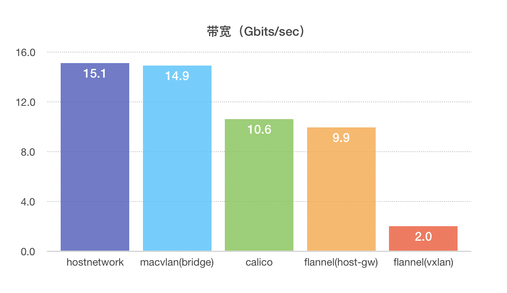

## 七、CNI方案性能对比

### 7.1、工具

使用了下面的基准来衡量容器网络的性能：

- Netperf：一个网络基准工具，提供单向吞吐量和端到端的延迟测量。
- Sockperf：为测试高性能系统的性能（吞吐量和延迟）而设计的网络基准工具，使用socket api。
- Sparkyfish：开源的网络带宽和延迟测试工具，使用TCP流来测试批量下载和上传的性能。
- OSU benchmarks：一个测量消息传递接口（Message Passing Interface ,MPI）应用的工具。

### 7.2、CNI

- flannel
- calico
- macvlan

### 7.3、场景

在同一套集群内，使用不同CNI方案进行测试。

- 单台机器上的容器
- 多台机器上的容器
- 网络包大小
- 网络协议
- 延迟
- 负载

### 7.4、数据

### 7.5、结果分析

| 项目       | macvlan(bridge)                   | calico                                                       | flannel(host-gw)          | flannel(vxlan)            |
| ---------- | --------------------------------- | ------------------------------------------------------------ | ------------------------- | ------------------------- |
| 网络模型   | underlay                          | underlay:纯三层                                              | underlay:纯三层           | overlay:vxlan             |
| IPAM       | 自定义                            | 每个主机分配一个subnet                                       | 每个主机分配一个subnet    | 每个主机分配一个subnet    |
| 方案       | 虚拟网卡                          | veth                                                         | linux bridge              | linux bridge              |
| 服务发现   | no                                | yes                                                          | yes                       | yes                       |
| 连通与隔离 | 连通：三层路由 隔离：二层vlan | 连通：同一个subnet 隔离：network policy 外网：把主机网关加入路由 | 没有隔离 外网：bridge | 没有隔离 外网：bridge |
| 性能       | 偏高                              | 略高                                                         | 略高                      | 偏低                      |

- hostnetwork性能最优

  ​		hostnetwork 场景下跨节点容器带宽性能最好，原因是由于通信过程中使用了主机网络栈，其他场景下由于使用了网络命名空间隔离（hostnetwork未用到网络命名空间），报文通信过程除了使用容器网络栈还都会经过主机网卡或者经过主机网络栈（除ovs和macvlan），所以性能上会有所损失。

- macvlan（bridge）性能接近hostnetwork

  ​		Macvlan由于跨过主机网络栈，直接从宿主机网卡将报文投递出去，所以性能会比其他非hostnetwork的场景高。由于不经过宿主机网络栈且没有控制流程，所以无法通过主机网络栈来实现网络访问控制。macvlan网络的连通与隔离完全依赖VLAN、IP Subnet和路由。因而macvlan适用于对网络安全要求低，但是追求网络性能的场景。

- 由于calico增加了报文在容器网络命名空间的处理，性能较hostnetwork下降30%

  ​		Calico使用了underlay网络实现跨主机容器通信，相比于hostnetwork场景，只是增加了容器网络栈的处理流程，性能下降了将近30%，相比于同样使用了有容器网络命名空间的macvlan，性能下降了29%。Flannel host-gw场景与calico场景的区别在于flannel host-gw使用linux bridge，而calico适用veth来连接主机和容器网络栈，性能差距1%左右。

- flannel vxlan性能最差

  ​		Flannel vxlan使用vxlan隧道技术，跨主机通信时要有报文的封装解封，性能上损耗比较明显，较hostnetwork方案下降了86%左右。flannel使用linux bridge来完成容器网络命名空间与宿主机/本节点容器通信，跟同是使用vxlan技术的canal（canal使用veth）相比性能略高1%。可以看出，直接使用veth的网络性能比linux bridge略高1%。

