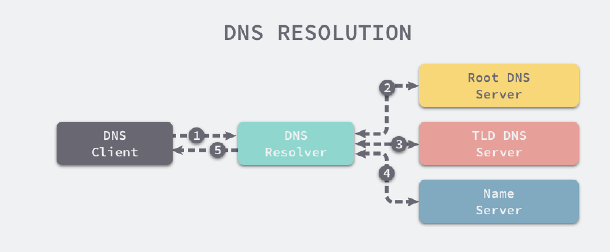
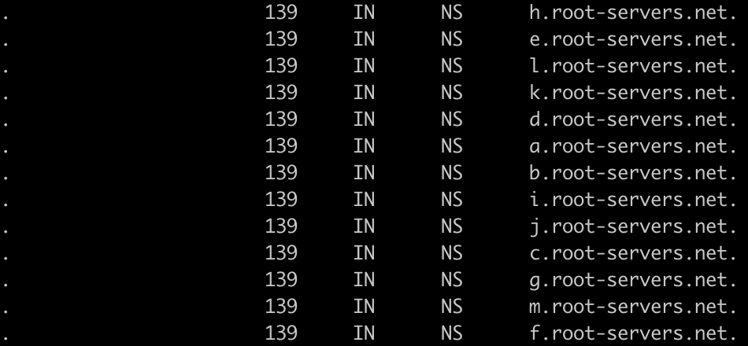
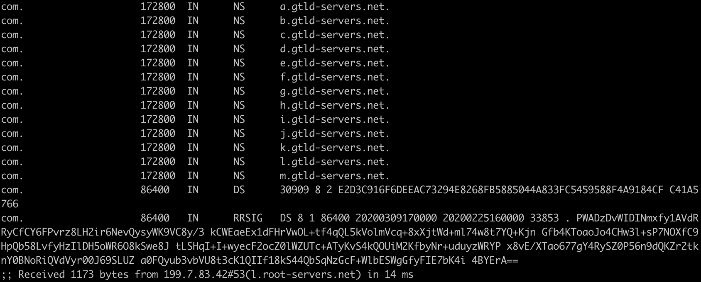
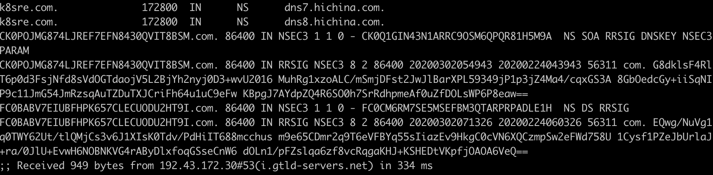
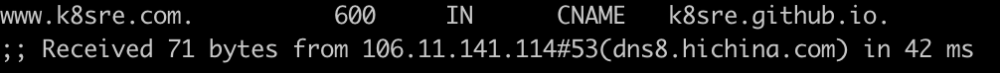
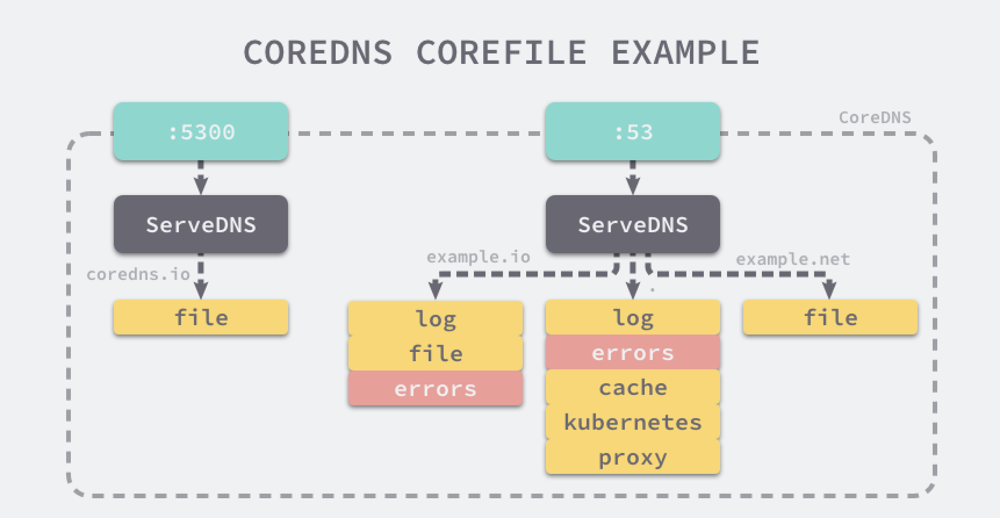

## 二、DNS

### 2.1、概述

​		从kubernetes 1.11版本开始，Kubernetes集群的DNS服务由CoreDNS提供。CoreDNS是CNCF基金会的一个项目，是用Go语言实现的高性能、插件式、易扩展的DNS服务端。CoreDNS解决了KubeDNS的一些问题，比如dnsmasq的安全漏洞、externalName不能使用stubDomains设置等。

​		CoreDNS支持自定义DNS记录及配置upstream DNS Server，可以统一管理kubernetes基于服务的内部DNS和数据中心的物理DNS。

​		CoreDNS的主要功能是通过插件系统实现的。CoreDNS实现了一种链式插件结构，将DNS的逻辑抽象成了一个个插件，能够灵活组合使用。

​		在kubernetes中定义的每个Service（包括DNS服务器本身）都会被指派一个DNS名称。默认，一个客户端Pod的DNS搜索列表将包含该Pod自己的Namespace和集群默认域。


### 2.2、DNS详解

​		DNS（Domain Name System）是一个分布式的树状命名系统，它像一个去中心化的分布式数据库，存储着从域名到IP地址的映射。

#### 2.2.1、DNS工作原理



- 本地客户端向DNS解析器发出解析`k8sre.com`请求。
- DNS解析器首先会向就近的根DNS服务器`.`请求顶级域名DNS服务器的地址。
- 拿到顶级域名DNS服务`com.`的地址之后会向顶级域名服务请求负责`k8sre.com.`域名解析的命名服务器。
- 得到授权的DNS命名服务器时，就可以根据请求的具体主机记录直接向该服务请求域名对应的IP地址。
- 客户端接收到IP地址之后，整个DNS解析的过程就结束了。接下来客户端通过IP向服务器发送请求。

​       对于DNS解析器，这里使用的DNS查询方式时迭代查询，每个DNS服务并不会直接返回DNS信息，而是会返回另一台DNS服务器的位置，由客户端依次询问不同级别的DNS服务直到查询得到了预期结果。而另外一种查询方式叫做递归查询，也就是DNS服务器收到客户端的请求之后会直接返回准确的结果，如果当前服务器没有存储DNS信息，就会访问其他的服务器并将结果返回给客户端。


#### 2.2.2、域名层级

​		域名层级时一个层级的树形结构，树的最顶层是根域名，一般使用`.`来表示。根域名下面的`com`、`net`、`cn`等是顶级域名。`k8sre.com`是次级域名也叫二级域名。`www.k8sre.com`是子域名或者叫三级域名。


#### 2.2.3、域名服务器

​		DNS解析器从根域名服务器查找到顶级域名服务器的IP地址，又从顶级域名服务器查找到权威域名服务器的IP地址，最终从权威域名服务器查出了对应服务的IP地址。

我们可以使用以下命令追踪`www.k8sre.com`域名对应的IP地址是如何被解析出来的。

```
dig -t -A www.k8sre.com +trace
```

首先会向13个根域名服务器发出请求获取顶级域名的地址



> 根域名服务器是DNS中最高级别的域名服务器，这些服务器负责返回顶级域的权威域名服务器地址，这些域名服务器的数量总共有13组，*域名的格式从上面返回的结果可以看到是* `.root-servers.net`，每个根域名服务器中只存储了顶级域服务器的 IP 地址，大小其实也只有 2MB 左右，虽然域名服务器总共只有 13 组，但是每一组服务器都通过提供了镜像服务，全球大概也有几百台的根域名服务器在运行。


然后我们获取到13条NS记录，也就是13台`com.`定义域名DNS服务器。可以看到是从`l.root-servers.net`根域名服务器获取到了`com.`顶级域名服务器。



然后可以看到获取到了`k8sre.com.`的权威域名服务器，并且是从`i.gtld-servers.net`顶级域名服务获取到的。这些权威DNS服务一般是域名提供商提供的。




最终从`dns8.hichina.com`这个权威域名服务器查询到了对应的IP地址。




### 2.3、CoreDNS详细

​		CoreDNS可以通过四种方式对外直接提供DNS服务，分别是UDP、gRPC、HTTPS和TLS。

​		对于CoreDNS定义的一个组来说，它会从上到下依次加载每一个插件。

​		CoreDNS可以通过简单易懂的DSL定义DNS服务，在Corefile中就可以组合多个插件对外提供服务。

kubelet有两个参数进行DNS相关的配置：

- `--cluster-dns`：指定DNS服务的ClusterIP。
- `--cluster-domain`：设置集群在DNS服务中的域名。




### 2.4、部署CoreDNS

#### 2.4.1、修改配置文件

在kubernets的二进制中已经有相应的yaml

```
tar zxvf kubernetes-src.tar.gz
cd kubernetes/cluster/addons/dns/coredns
```

修改配置

```
CLUSTER_DNS_DOMAIN="cluster.local"
CLUSTER_DNS_SVC_IP="10.64.0.2"
CLUSTER_DNS_LIMIT_MEMORY="170Mi"

sed -i -e "s@__PILLAR__DNS__DOMAIN__@${CLUSTER_DNS_DOMAIN}@" -e "s@__PILLAR__DNS__SERVER__@${CLUSTER_DNS_SVC_IP}@" -e "s@__PILLAR__DNS__MEMORY__LIMIT__@${CLUSTER_DNS_LIMIT_MEMORY}@" coredns.yaml.base

//gcr.azk8s.cn是Azure中国镜像，建议使用私有镜像仓库
sed -i "s@k8s.gcr.io/coredns:1.6.2@gcr.azk8s.cn/google-containers/coredns:1.6.2@" coredns.yaml.base
```


#### 2.4.2、创建CoreDNS

```
mv coredns.yaml.base coredns.yaml
kubectl apply -f coredns.yaml
```


#### 2.4.3、验证CoreDNS

```
kubectl exec nginx-8458df589f-jq6zh nslookup kube-dns.kube-system.svc.cluster.local.
```


#### 2.4.4、配置外部DNS

```
  Corefile: |
    .:53 {
        errors
        health
        kubernetes cluster.local. in-addr.arpa ip6.arpa {
            pods insecure
            upstream
            fallthrough in-addr.arpa ip6.arpa
        }
        prometheus :9153
        proxy . /etc/resolv.conf
        cache 30
        reload
        loadbalance
    }
    .anymb.com {
    forward . 10.0.13.100 10.0.3.162 10.0.3.223
    }
```


#### 2.4.5、绑定hosts

```
        hosts {
            119.3.105.139 ldaps.daocloud.io
            fallthrough
        }
```


#### 2.4.6、从etcd中获取域名记录

添加etcd配置

```
        etcd com {
            path /mydns
            endpoint http://10.10.200.201:2379
            upstream /etc/resolv.conf
        }
```

往etcd插入一条dns记录

```
etcdctl put /mydns/com/k8sre '{"host":"1.1.1.1","ttl":60}'
```


### 2.5、CoreDNS配置详解

常用的配置如下：

- `loadbalance`：提供基于DNS的负载均衡功能。
- `loop`：检测在DNS解析过程中出现的简单循环问题。
- `cache`：提供前端缓存功能。
- `health`：对endpoint进行健康检查。
- `kubernetes`：从kubernetes中读取zone数据。
- `etcd`：从etcd读取zone数据，可以用于自定义域名记录。
- `file`：从RFC1035格式文件中读取zone数据。
- `hosts`：使用/etc/hosts文件或其他文件读取zone数据，可以用于定义域名记录。
- `auto`：从磁盘中自动加载区域文件。
- `reload`：定时自动重新加载Corefile配置。
- `forward`：转发域名查询到上游DNS服务器。
- `proxy`：转发特定的域名查询到多个其他DNS服务器，同时提供到多个DNS服务器的负载均衡功能。
- `prometheus`：为Prometheus提供采集性能指标数据的URL。
- `pprof`：在URL路径/debug/pprof下提供运行时的性能数据。
- `log`：对DNS查询进行日志记录。
- `errors`：对错误信息进行日志记录。


### 2.6、node-local-dns

#### 2.6.1、概述

​		NodeLocal DNS通过在集群节点上以DaemonSet的方式运行DNS缓存代理来提高集群DNS性能。

​		在现在的体系结构中，处于ClusterFirst DNS模式的Pod可以连接到CoreDNS的ServiceIP进行DNS查询。通过kube-proxy添加的iptables规则将其转换为CoreDNS端点。

​		借助这种架构，Pod可以访问在同一节点上运行的DNS缓存代理，从而避免了iptables DNAT规则和连接跟踪。本地缓存代理将查询CoreDNS服务以获取集群主机名的缓存缺失（默认为cluster.local后缀）。


#### 2.6.2、优点

- 使用当前的DNS体系结构，如果没有本地CoreDNS实例，则具有最高DNS QPS的Pod可能必须延伸到另一个节点。在这种情况下，使用本地缓存将有助于改善延迟。
- 跳过iptables DNAT和连接跟踪将有助于减少conntrack竞争并避免UDP DNS条目填满conntrack表。
- 从本地缓存代理到CoreDNS服务的连接可以升级到TCP。TCP conntrack条目将在连接关闭时被删除，相反UDP条目必须超时（默认`nf_conntrack_udp_timeout`是30秒）。
- 将DNS查询从UDP升级到TCP将减少归因于丢弃的UDP数据包和DNS超时的尾部等待时间，通常长达30秒（3次重试+10秒超时）。
- 在节点级别对dns请求的度量和可见性。
- 可以重新启用负缓存，从而减少对CoreDNS服务的查询数量。


#### 2.6.3、架构


### 2.7、部署node-local-dns

在kubernets的二进制中已经有相应的yaml

```
tar zxvf kubernetes-src.tar.gz
cd kubernetes/cluster/addons/dns/nodelocaldns
```

修改配置

```
CLUSTER_DNS_DOMAIN="cluster.local"
CLUSTER_DNS_SVC_IP="10.64.0.2"
UPSTREAM_SERVERS="/etc/resolv.conf"
CLUSTER_DNS="10.64.0.10"
LOCAL_DNS_IP="169.254.20.10"


sed -i \
-e "s@__PILLAR__DNS__DOMAIN__@${CLUSTER_DNS_DOMAIN}@" \
-e "s@__PILLAR__DNS__SERVER__@${CLUSTER_DNS_SVC_IP}@" \ 
-e "s@__PILLAR__UPSTREAM__SERVERS__@${UPSTREAM_SERVERS}@" \
-e "s@__PILLAR__CLUSTER__DNS__@${CLUSTER_DNS}@" \
-e "s@__PILLAR__LOCAL__DNS__@${LOCAL_DNS_IP}@" \
nodelocaldns.yaml

//gcr.azk8s.cn是Azure中国镜像，建议使用私有镜像仓库
sed -i "s@k8s.gcr.io/k8s-dns-node-cache:1.15.7@gcr.azk8s.cn/google-containers/k8s-dns-node-cache:1.15.7@" nodelocaldns.yaml
```

创建

```
kubectl apply -f nodelocaldns.yaml
```


### 2.8、支持的DNS模式

#### 2.8.1、Service

**A记录**

​		普通的Service（除了Headless Service）会以`my-svc.my-namespace.svc.cluster.local`这种名字的形式分配一个DNS的A记录。这会解析成该Service的ClusterIP。

​		Headless Service（没有ClusterIP）也会以`my-svc.my-namespace.svc.cluster.local`这种名字的形式分配一个DNS的A记录。跟普通Service的区别在于，Headless Service会解析为该Service选择的一组Pod的IP。客户端能够使用这一组IP，默认使用标准的轮询策略从这一组IP中进行选择。

**SRV记录**

​		命名端口需要创建SRV记录，这些端口是普通Service或Headless Service的一部分。对于每个命名端口，SRV记录具有`_my-port-name._my-port-protocol.my-svc.my-namespace.svc.cluster.local`这种形式。对于普通Service，这会被解析成端口号和CNAME。对于Headless Service，这会被解析成多个结果，Service对应后端的每个Pod各一个。


#### 2.8.2、Pod

​		当Pod创建后，它的主机名是该Pod`metadata.name`的值。PodSpec有一个可选的`hostname`字段，可以用来指定Pod的主机名，它优先于Pod的名称称为该Pod的主机名。PodSpec还有一个可选的`subdomain`字段，可以用来指定Pod的子域名。

Pod可以通过`spec.dnsPolicy`字段设置DNS策略：

- `Default`：Pod从所在宿主机继承DNS解析设置。Default并不是默认DNS策略。
- `ClusterFirst`：优先使用集群的DNS服务，将无法解析的域名转发到从宿主机继承的DNS服务器。是默认的DNS策略。
- `ClusterFirstWithHostNet`：对于使用hostnetwork运行的Pod，应使用此策略。用于使用集群的DNS服务。
- `None`：忽略集群环境中的DNS配置，通过`spec.dnsConfig`进行自定义配置。


​		Pod的DNS配置可以让用户对Pod的DNS设置进行更多的控制。可以与dnsPolicy配合使用，但当dnsPolicy设置为"None"时，必须指定dnsConfig配置。

- `nameservers`：DNS服务器的IP地址列表，最多可以设置3个。当dnsPolicy设置为None时，列表至少要包含一个IP地址，否则此配置是可选的。
- `searches`：用于域名搜索的DNS域名后缀，最多可以设置6个。
- `options`：配置其他可选DNS参数。以name/value的形式表示。

