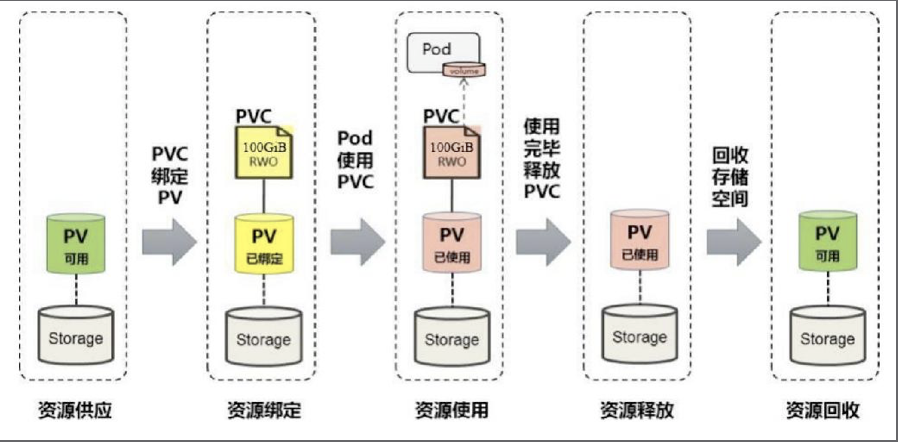

## 一、PV和PVC的声明周期

### 1.1、PV和PVC的生命周期

​		PV是集群中的资源。PVC则是对这些资源的请求，并且还充当对资源的声明检查。PV和PVC之间的交互遵循以下生命周期。

#### 1.1.1、资源供应

Kubernetes支持两种资源的供应模式：静态模式和动态模式。

**静态模式**

​		集群管理员手工创建很多PV，在定义时需要配置后端存储的属性。

**动态模式**

​		集群管理员无需手工创建PV，而是通过存储类（StorageClass）设置对后端存储的配置。配置PVC对存储类型的声明，系统将会自动完成PV的创建以及与PVC的绑定。如果PVC的存储类声明为`“”`，表明禁用了动态模式。

#### 1.1.2、资源绑定

​		用户定义好PVC后，系统将根据PVC对存储资源的请求（存储空间和访问模式）在已经存在的PV中选择一个满足PVC要求的PV，一旦找到，就将该PV与用户定义的PVC进行绑定，用户的应用就可以使用这个PVC了。如果在系统中没有满足PVC要求的PV，PVC则会无限期处于Pending状态，知道等到系统管理员创建了一个符合要求的PV。PV一旦绑定到某个PVC上，就会被这个PVC独占，不能再与其他PVC进行绑定了。在这种情况下，当PVC申请的存储空间比PV的少时，整个PV的空间就都能够为PVC所用，可能会造成资源浪费。如果资源供应使用的是动态模式，则系统在为PVC找到合适的存储类（StorageClass）后，将自动创建一个PV并完成与PVC的绑定。

#### 1.1.3、资源使用

​		Pod使用Volume的定义，将PVC挂载到容器内的某个路径进行使用。Volume的类型为PersistentVolumeClaim。在容器应用挂载了一个PVC后，就能被持续独占使用。不过，多个Pod可以挂载同一个PVC，应用程序需要考虑多个实例共同访问一块存储空间的问题。

#### 1.1.4、资源释放

​		当用户对存储资源使用完毕后，用户可以删除PVC，与该PVC绑定的PV将会被标记为“已释放”，但还不能立刻与其他PVC进行绑定。之前PVC写入的数据可能还被留在存储设备上，只有在清除之后该PV才能再次使用。

#### 1.1.5、资源回收

​		对于PV，管理员可以设定回收策略，用于设置与之绑定的PVC释放资源之后如何处理遗留的数据问题。只有PV的存储空间完成回收，才能供新的PVC绑定和使用。

