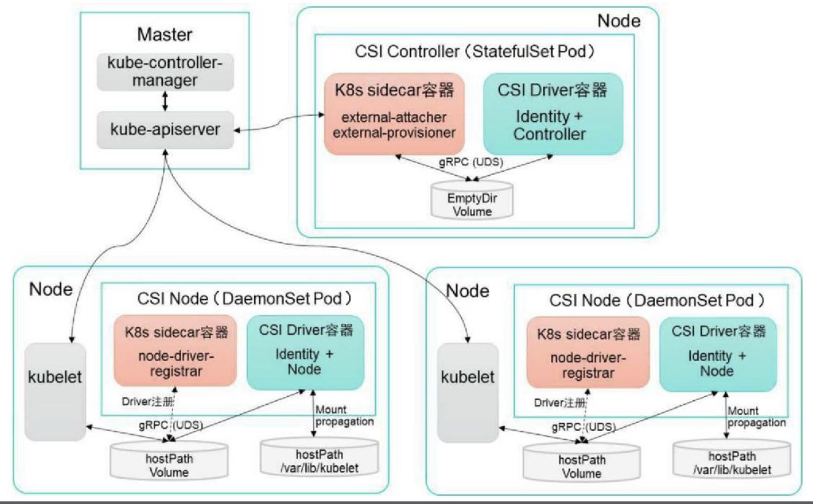

## 六、CSI

### 6.1、概述

​		Kubernetes从1.9版本开始引入容器存储接口Container Storage Interface（CSI）机制，目标是在Kubernetes和外部存储系统之间建立一套标准的存储管理接口，通过该接口为容器提供存储服务，类似于CRI（容器运行时接口）和CNI（容器网络接口）。

### 6.2、架构

### 6.3、组建

​		CIS主要包含两种组件：CSI Controller和CSI Node。

#### 6.3.1、CSI Controller

​		CSI Controller的主要功能是提供存储服务视角对存储资源和存储卷进行管理和操作。在kubernetes中建议将其部署为单实例Pod，可以使用StatefulSet或Deployment控制器进行部署，设置副本为1，保证为一种存储插件只运行一个控制器实例。

在这个Pod内运行两个容器：

- 与Master（kube-controller-manager）通信的辅助sidecar容器。在sidecar容器内又可以包含external-attacher和external-provisioner两个容器，它们的功能分别如下：
  - **external-attacher**：监控VolumeAttachment资源对象的变更，触发针对CSI端点的`ControllerPublish`和`ControllerUnpublish`操作。
  - **external-provisioner**：监控PersistentVolumeClaim资源对象的变更，触发针对CSI端点的`CreateVolume`和`DeleteVolume`操作。

- CSI Driver存储驱动容器，由第三方存储提供商提供，需要实现上述接口。

​		这两个容器通过本地Socket（Unix Domain Socket，UDS），并使用gPRC协议进行通信。SideCar容器通过Socket调用CSI Driver容器的CSI接口，CSI Driver容器负责具体的存储卷操作。

#### 6.3.2、CSI Node

​		CSI Node的主要功能是对主机（Node）上的Volume进行管理和操作。在kubernetes中建议将其部署为DaemonSet，在每个Node上都运行一个Pod。	

在这个Pod内运行两个容器：

- 与kubelet通信的辅助sidecar容器node-driver-registrar，主要功能是将存储驱动注册到kubelet中。
- CSI Driver存储驱动器，由第三方存储提供商提供，主要功能是接收kubelet的调用，需要实现一系列与Node相关的CSI接口。

​        node-driver-registrar容器与kubelet通过Node主机的一个hostPath目录下的unix socket进行通信。CSI Driver容器与kubelet通过Node主机的另一个hostPath目录下的unix socket进行通信，同时需要将kubelet的工作目录挂载给CSI Driver容器，用于为Pod进行Volume的管理操作。