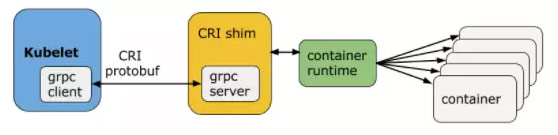

## 八、CRI

### 8.1、概述

​		CRI（Container Runtime Interface）是一种能让kubelet无需重新编译就可以支持多种容器运行时的插件接口。

### 8.2、CRI组件

​		Kubelet与容器运行时通信时（或者说CRI插件填充了容器运行时），Kubelet就像是客户端，而CRI插件就像对应的服务器。他们之前通过Unix套接字或gRPC框架进行通信。

​		Protocol Buffers API包含了两个gRPC服务：ImageService和RuntimeService。

​		ImageService提供了从镜像仓库拉取、查看、和移除镜像的RPC。

​		RuntimeSerivce包含了Pods和容器生命周期管理的RPC，以及跟容器交互的调用（exec/attach/port-forward）。一个容器运行时能够管理镜像和容器，并且通过同一个套接字同时提供着两种服务。这个套接字可以在kubelet中通过标识`--container-runtime-endpoint`和`--image-service-endpoint`进行配置。

### 8.3、生命周期管理

​		Pod由一组应用容器组成，其中包含共有的环境和资源约束。在CRI里，这个环境被称为PodSandbox。

​		Kubernetes有意为容器运行时留下以下发挥空间，他们可以根据自己的内部实现来解释PodSandbox。对于Hypervisor类的运行时，PodSandbox会具体化为一个虚拟机。对于其他的，比如Docker，会是一个Linux命名空间。这个PodSandbox一定遵循着Pod的资源定义。

​		在v1alpha1版API里，kubelet将创建pod级的cgroup限制下的一组进程，并传递给容器运行时，并以此运行所有进程来满足PodSandbox对Pod的资源保障。

​		在Pod启动前，kubelet调用`RuntimeService.RunPodSandbox`来创建环境，包括为Pod设置网络（例如：分配IP）等。当PodSandbox启动后，就可以分别创建、启动、停止、移除独立的容器。为了删除Pod，kubelet会在停止和移除所有容器前先停止和移除PodSandbox。

​		Kubelet负责通过RPC来进行容器生命周期的管理，测试容器生命周期钩子和健康/可读性检查，同时为Pod提供重启策略。

